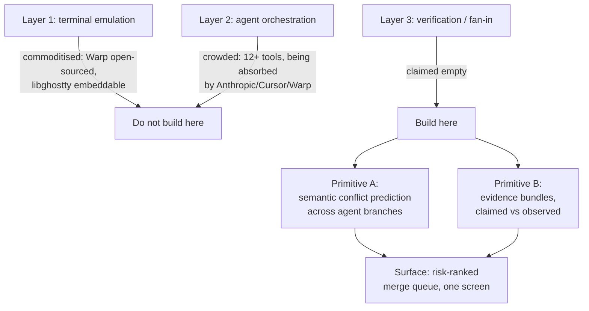
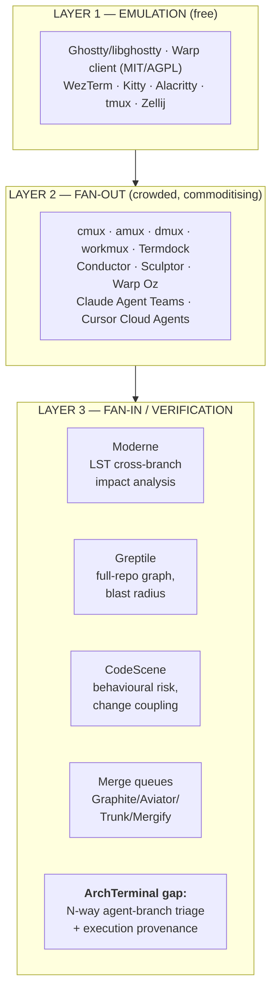
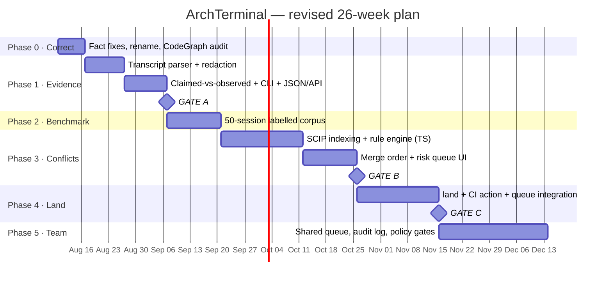

# ArchTerminal / SuperTerminal — Engineering & Strategy Review

**Reviewer stance:** CTO / staff engineer / founding engineer / CS researcher / docs lead.
**Input reviewed:** `ArchTerminal-Research.md` (445 lines, Aug 2026, pre-code).
**Method:** full read of the source doc; independent verification of all 21 cited URLs; six parallel research streams covering Layer-1 terminals, Layer-2 orchestrators, the productivity statistics, semantic-merge prior art, adjacent commercial products, and implementation feasibility.
**Verdict in one line:** **the strategic pivot is right and should be kept; three of the arguments used to justify it are wrong, and the build order is backwards.**

---

## 0. Executive summary

| | Assessment |
|---|---|
| **Strategic direction** (don't build a terminal; build fan-in) | ✅ **Endorse.** Well-reasoned, correctly reads where value is draining. |
| **Evidence quality** | ⚠️ **Mixed.** All URLs real, no fabricated sources — but the single most-quoted statistic is a splice of two unrelated studies. |
| **Moat claim** ("nobody solves semantic conflicts") | ❌ **False.** 15 years of prior art; one cited source, Moderne, is an unrecognised direct competitor. |
| **Compliance wedge** (EU AI Act Art. 12) | ❌ **Does not apply.** Misreads the regulation. Remove it. |
| **Technical plan** | ⚠️ **Two dead components, one wrong ground-truth source.** Fixable, and the fixes are cheaper than the plan. |
| **Build order** (conflicts first, evidence second) | ❌ **Invert it.** The cheap, certain, unique feature is scheduled second behind the expensive, uncertain, contested one. |

**The three changes that matter most:**

1. **Ship evidence before conflicts.** Claimed-vs-observed verification is ~2 weeks of work, has no false-positive risk, and its ground truth is already sitting on disk in agent transcript logs. Semantic conflict prediction is a 15-year-old research problem with a hard precision ceiling. The doc schedules the risky one first.
2. **Precision is not negotiable; recall is.** Retarget from 80% precision to ≥95% with explicit abstention. A trust product that cries wolf once is dead. Published work shows 100% precision costs ~36 points of recall — pay it.
3. **Delete the compliance narrative and the −19% statistic.** Both are checkable, and both fail on being checked. In a product whose entire pitch is "we prove things," being caught overstating is an existential category error.

**And the one thing nobody else can follow us into** (§5.1): *every* competitor treats the agent's self-report as truth. First-party vendors — Anthropic, Cursor, Warp — are structurally unable to ship the feature "your agent lied about running the tests," because it indicts their own product. That is not a feature gap. It is an incentive gap, and incentive gaps are the only durable kind.

---

## 1. Project summary

**What exists:** one document. No code, no repo, no git history. This is a strategy artifact at the decision point, which is the correct and cheapest moment to review it.

**The product it proposes.** A "fan-in console" for parallel AI coding agents. The reasoning chain:

**Core insight, stated fairly:** every tool on the market optimises *launching* agents. Nobody optimises *absorbing* their output. Worktrees prevent git conflicts and do nothing about semantic ones — agent A renames `parse_config()`, agent B adds callers to it, both merge clean, `main` breaks.

**Constraints the doc sets itself:** local-first, privacy-first, integration-not-replacement, agent-agnostic, Rust engine + TypeScript UI, SQLite storage, three languages deep rather than twelve shallow, 8-week v0 with a sharp kill criterion.

**Assets claimed:** CodeGraph, SuperSearch, AgentMesh. ⚠️ *None of these are in the repository and I could not inspect them.* The entire moat argument in §6 and §11 of the source doc rests on CodeGraph being real, multi-language, and incremental. **This is the largest unverified dependency in the plan** — see §10, Open Questions.

---

## 2. Verification audit

This is the section I'd want first if I were the founder, because the doc's persuasive force comes from its numbers.

**Good news:** all 21 cited URLs resolve (HTTP 200, verified programmatically). The arXiv citation is exactly what it claims — *"From Agent Traces to Trust: A Survey of Evidence Tracing and Execution Provenance in LLM Agents,"* arXiv 2606.04990, 2026-06-03. This document is **not** LLM-hallucinated slop. It is a real research effort, and it earns the right to be taken seriously.

**Bad news:** the interpretation layer has three failures, and they are load-bearing.

### 2.1 Statistics

| Doc claim | Reality | Verdict |
|---|---|---|
| Tasks completed +21% | Confirmed (Google / Faros AI telemetry) | ✅ |
| PRs merged +98% | Confirmed (Faros AI / LinearB) | ✅ |
| PR review time +91% | Confirmed (Faros AI 2025, 1,255 teams / 10k devs) | ✅ |
| Agentic PR pickup 5.3× longer | Confirmed (LinearB 2026, 8.1M PRs / 4,800 orgs) | ✅ |
| AI code 1.7× more issues | Confirmed (CodeRabbit Dec 2025, 470 OSS PRs) — ⚠️ vendor-published | ✅ |
| Junior devs +10–30% | Directional only; no clean primary source | ⚠️ |
| **96% don't fully trust AI code** | Real figure, but from **Sonar** (n=1,100), not Stack Overflow. SO 2025 (n=49,000) reports 33% trust / 46% distrust. | ⚠️ **Misattributed** |
| **"LinearB, 8.1M PRs, 4,800 orgs: feel +20% faster, actually −19% slower"** | **Two different studies welded together.** LinearB supplied the 8.1M-PR dataset. The +20%/−19% perception gap is **METR's July 2025 RCT, n=16** experienced OSS devs on familiar repos. | ❌ **Conflated** |

**Why the conflation is serious.** The doc calls this "a 39-point self-deception gap" and uses it as the emotional peak of §4. As written it implies enterprise-scale proof (millions of PRs) for a finding that comes from sixteen developers. METR's own authors caution against generalising it. Anyone in a funding conversation who knows the METR study will catch this, and the credibility loss will be disproportionate — precisely because this is a company selling verification.

**Fix:** cite them separately and honestly. *"LinearB (8.1M PRs) shows agentic PRs sit 5.3× longer. Separately, METR's RCT (n=16) found experienced developers were 19% slower while believing they were 20% faster — small sample, but the only controlled experiment we have."* That is still a strong argument. It's just a true one.

### 2.2 What the doc missed on the data

**DORA 2025 supports the thesis better than the statistic the doc invented.** DORA found AI adoption correlates with *higher delivery instability* — increased change-failure rates — because generation outpaces verification gates. That is a direct, well-sourced, large-sample argument for exactly this product. **Use DORA instead of the METR splice.** It is stronger evidence and it is real.

### 2.3 Market facts

Mostly solid. Corrections:

| Doc claim | Reality |
|---|---|
| Warp open-sourced client, MIT/AGPL, April 2026 | ✅ Confirmed |
| Warp pricing $20 Build / $50 Business | ✅ Confirmed |
| Oz = proprietary cloud orchestrator | ✅ Confirmed — **but** it also supports self-hosted VPC data planes and BYO-orchestrator CLI. Partly blunts the "local-first is our differentiator" claim. |
| libghostty embeddable | ✅ Confirmed; `libghostty-vt` ships standalone, no libc |
| Ghostty ~4× iTerm2 | ⚠️ Overstated as a flat figure; benchmarks vary 2–5×, workload-dependent |
| ~60k stars, OpenAI founding sponsor | ⚠️ Unverified |
| cmux = Manaflow, YC S24, Swift + libghostty | ✅ Confirmed |
| Conductor = YC, $22M Series A | ✅ Confirmed (Melty Labs, March 2026); now adding cloud microVMs |
| Vibe Kanban / Bloop shutdown April 2026 | ✅ Confirmed (10 April 2026, free-to-paid conversion failure) |
| Claude Code `--agent-teams` "ships, zero install" | ⚠️ **Overstated** — experimental, gated behind `CLAUDE_CODE_EXPERIMENTAL_AGENT_TEAMS=1` |
| Cursor "Background Agents" | ⚠️ Renamed **Cloud Agents**; run in cloud VMs, not local worktrees |
| **ittybitty** | ❌ Could not verify existence |
| **Superset** ("code editor for AI agents") | ❌ Could not verify; likely conflated with Apache Superset |

The doc's "12+ tools" count is inflated by roughly two. Its argument survives easily — ten is still crowded — but a competitor list with phantom entries is a credibility liability in the same way the statistics are.

⚠️ **Naming hazard the doc doesn't flag:** `cmux`, `amux` and `Conductor` are each ambiguous (coder/openai's cmux; three separate amux repos in Python/Go/Rust; Conductor AI and Orkes/Netflix Conductor). Any published comparison must disambiguate or it will be dismissed.

---

## 3. Technical & product review

### 3.1 What the plan gets right

- **Refusing to build a terminal emulator.** Correct, and the strongest judgement in the document. Warp's open-sourcing genuinely converts Layer 1 into a free input.
- **Integration over replacement.** The §5 user monologue ("my switching cost isn't download an app, it's re-learn my hands") is the sharpest writing in the doc and the correct product constraint.
- **Local-first, privacy-first.** Right call for a tool sitting next to `.env` files, AWS keys and SSH agent sockets.
- **Boring stack.** Rust engine, TypeScript UI, SQLite, tree-sitter, ripgrep. No novel UI toolkit, no RocksDB, no service mesh.
- **Killing "deterministic replay."** Genuinely good judgement — undeliverable, and claiming it once and failing once destroys every other claim. Replacing it with *provenance + differential proof* is honest and more useful.
- **Pre-committed kill criteria.** Rare and valuable.
- **Depth over coverage** (3 languages well, not 12 badly) in a trust product. Correct.

### 3.2 Where the technical plan breaks

#### (a) ❌ The build order is inverted — highest-impact finding

The doc puts the **conflict engine in v0 (weeks 1–8)** and **evidence bundles in v1 (weeks 9–20)**. Compare honestly:

| | Semantic conflict prediction | Claimed-vs-observed evidence |
|---|---|---|
| Ground truth | Must be constructed (50-session labelled benchmark) | **Already on disk** — agent transcript logs |
| Nature | Probabilistic prediction | **Factual assertion** |
| False-positive risk | High — and fatal to trust | **≈ Zero** |
| Prior art | 15 years, well-funded incumbents | Essentially none for coding agents |
| Realistic effort | 8+ weeks, uncertain | **~2 weeks** |
| Demo impact | "It found a conflict" (needs setup to be legible) | **"Your agent said it ran the tests. It didn't."** |
| Defensibility | Contested (Moderne, Greptile, CodeScene) | Uncontested, and structurally protected (§5.1) |

The evidence primitive is cheaper, more certain, more unique, *and* has the better demo. The doc half-realises this — §6.2 says the claimed-vs-observed badge "is worth more to a reviewer than any dashboard in this document" — then schedules it in phase two.

**Recommendation: swap them.** Ship claimed-vs-observed in weeks 1–3. It is a complete, standalone product for the *single-agent* case — a vastly larger market than "developers running ≥3 parallel agents" — which directly de-risks the doc's own Risk #1.

#### (b) ❌ PTY scraping is the wrong ground truth

The proposed PTY shim (`superterminal exec -- claude ...`) is brittle: ANSI escapes, interactive TUIs, resize events, shell variance, exit codes that never appear in the stream, and secrets leaking into the log.

**Modern CLI agents already emit structured JSONL session transcripts** (Claude Code writes to `~/.claude/projects/`), recording tool invocations, commands and results directly.

**Recommendation:** transcript-first; PTY as fallback for agents without structured logs. Turns the hardest v1 component into a JSONL reader — weeks to days. Keep `portable-pty` (WezTerm crate) in reserve, noting it lives inside the WezTerm monorepo (a real supply-chain consideration).

#### (c) ❌ `stack-graphs` is dead

GitHub archived `github/stack-graphs` on **9 September 2025**. → Use Sourcegraph **SCIP** (`scip-typescript`, `scip-python`, rust-analyzer SCIP output).

#### (d) ⚠️ The incremental-indexing assumption is optimistic

"Incremental, cached by tree-hash" — in practice SCIP indexers require a **full pass** per branch. An N-branch matrix is **O(N) full indexes**. Survivable for an overnight/morning workflow, but must be designed for deliberately. **Pre-index on worktree creation, not on `plan` invocation.**

#### (e) ⚠️ 80% precision is the wrong target — it's the academic floor

| Tool | Year | Precision | Recall |
|---|---|---|---|
| IntelliMerge (graph-based, refactoring-aware, Java) | 2019 | 88.5% | 90.2% |
| ConflictLens (LLM + static/dynamic) | ~2024 | 91% | 76% |
| LLM + judge | 2024–25 | ~100% | 64% |

80% ships a tool that is wrong one time in five. Users forgive a miss; they do not forgive a false alarm that wastes twenty minutes.

**Recommendation:** **≥95% precision with explicit abstention.** Three tiers — `CONFLICT` (high-confidence rules), `REVIEW` (heuristic), `UNKNOWN` (analysis incomplete, *and say so*). Catching 60% with zero false alarms builds a habit; 90% with 20% false alarms destroys one.

#### (f) ⚠️ Bespoke evidence bundles vs. in-toto / SLSA

A local hash chain is sound and correctly avoids Trillian/Rekor overkill. But a bespoke-only format isolates you from every downstream consumer that already understands attestations.

**Recommendation:** hash-chained SQLite internally (keep it), **plus in-toto / SLSA attestation as export**. Days of work, buys CI and supply-chain interoperability.

#### (g) Minor: the merge-order solver is smaller than it looks

Minimum-feedback-arc-set: NP-hard in general, trivial at N ≤ 10. **Brute-force exact solve.** ~1 day; the doc implies more.

### 3.3 ❌ The compliance wedge does not survive contact with the regulation

EU AI Act **Article 12 mandates logging for high-risk AI *systems*** — the classification attaches to the *deployed product* (biometrics, credit scoring, medical devices), not to an internal coding assistant used to build it. ISO/IEC 42001 is a voluntary process framework (PDCA), not a technical mandate for cryptographic logs.

Pitching engineering managers on AI Act exposure fails the moment it reaches legal, and taints everything else you said.

**Recommendation: cut the regulatory framing.** Replace with the defensible version: *"a standard, verifiable audit trail of what automated agents changed in your codebase"* — sold on **internal governance, incident forensics and supply-chain review**. Regulated customers will map it to their own obligations. Let them.

### 3.4 Product review

**The one-screen risk queue (§6.3) is the strongest artifact in the document.** Build it first as a static HTML mock and show it to twenty developers before writing any engine.

**Naming.** The product is called *SuperTerminal*, in a folder called `arch_Terminal`, and the thesis is *"do not build a terminal, never require users to switch terminals."* The name argues against the strategy and invites the exact objection §5 identifies as fatal. Identity here is the **fan-in thesis**, not the word "Terminal."
**Recommendation:** rename around the verb. `land` — already the CLI verb the doc chose — is the good name hiding inside the bad one, and the doc's own "superb cockpit with no landing gear" line is the pitch.

**Under-specified:** stale/rebased/abandoned worktrees; monorepos; what happens *after* a conflict is flagged; cost attribution (nearly free — same transcript source).

---

## 4. Competitor comparison

### 4.1 The market map, corrected

Layer 3 is **not empty** — it's occupied from three directions by companies that don't yet realise they're converging.

### 4.2 Competitors the doc missed

| Product | What it does | Overlap | Funding |
|---|---|---|---|
| **Moderne** | Lossless Semantic Trees; cross-branch/cross-repo semantic impact analysis at scale | 🔴 **Direct** | Commercial, enterprise |
| **Greptile** | Full-codebase index, multi-hop reasoning, cross-file bug impact in review | 🔴 **Direct** (blast radius) | Seed ~$4M |
| **CodeScene** | Behavioural analysis, temporal coupling, risk-ranked PRs | 🔴 **Direct** (risk ranking) | Series A ~$10M |
| **Graphite** (+ Diamond) | Stacked PRs, merge queue, AI review | 🟡 Partial | Series B ~$115M |
| **Aviator / Trunk.io / Mergify** | Parallel merge queues, batching, auto-rebase, flaky-test handling | 🟡 Partial | $14–25M each |
| **Qodo** | Multi-repo governance, contextual bounds | 🟡 Partial | Series A ~$40M |
| **AgentOps** | Agent session replay, time-travel debugging | 🟡 Partial | Seed ~$3M |
| **CodeRabbit / Bito / Sourcery / CodeGuru** | PR-scoped AI review | 🟢 Low | $3–16M |
| **LangSmith / Langfuse / Braintrust / Weave** | LLM tracing at API level — no shell evidence | 🟢 Low | $4–60M |

### 4.3 So is the wedge dead?

**No — but it must be restated honestly.**

❌ Dead claim: *"Nobody does semantic conflict detection."* False. Crystal (2011), WeCode (2012), IntelliMerge (2019), SafeMerge, SemanticMerge→Unity Plastic SCM, ConflictLens (2024), Moderne, CodeScene, Greptile.

✅ Surviving claim: **"Nobody does N-way, pre-merge, symbol-level triage of concurrent *agent* branches, locally, agent-agnostically, with proof of what actually executed."**

The moat is **execution and integration**, not novel computer science. §11's "publishable research contribution" framing is the weakest part of the source doc — cross-branch conflict prediction has a 15-year literature. *Agent-branch triage with execution provenance* is the novel part.

---

## 5. Where competitors are wrong, weak, and exploitable

The previous section says who they are. This section is the offensive brief: what each rival is **strategically wrong** about, where they are **structurally weak**, and — critically — **whether attacking it is worth anything to us.**

Not every weakness is an opportunity. Several are deliberate, correct choices that would cost us dearly to attack. Those are marked as traps.

### 5.1 The industry-wide blind spot — the one that matters

Five errors are shared by essentially every player. The last is the important one.

| # | Shared error | Why it persists | Exploitable? |
|---|---|---|---|
| 1 | **More parallelism is assumed good** | Everyone sells fan-out; nobody's metric is "changes safely landed" | ✅ Reframe the metric |
| 2 | **The unit of work is the PR / the command** | Inherited from the human era | ✅ Our unit is the *branch set* |
| 3 | **Review tools optimise recall over precision** | Comment volume looks like value; produces alert fatigue | ✅ Rank and gate, don't comment |
| 4 | **Cloud-first indexing** | SaaS margins; ignores that env, secrets and DB are local | ✅ Local-first |
| 5 | 🔴 **The agent's self-report is treated as ground truth** | **See below** | ✅✅ **The core wedge** |

**Error #5 is the franchise.** Every tool in every layer — orchestrators, review bots, LLM observability — ingests what the agent *said* it did. When an agent writes "I ran the tests and they pass," that string propagates into the PR description, the review summary, and the trace, unverified. Nobody checks the transcript against the claim.

**Why this gap is durable, and not merely unnoticed:**

- **First-party vendors cannot ship it.** Anthropic, Cursor and Warp sell agent *generation*. A prominent badge reading *"tests claimed: yes / tests observed: no"* is a product that publicly indicts their own output quality. Their incentive is to make the agent look reliable; ours is to make it *checkable*. This is an **incentive gap, not a feature gap** — and incentive gaps are the only kind a well-funded competitor can't simply close next quarter.
- **Review tools are positioned wrong for it.** CodeRabbit and Greptile analyse the *diff*. Whether a command executed is not in the diff; it's in the session transcript, which they never see.
- **LLM observability platforms are at the wrong altitude.** LangSmith, Langfuse, Braintrust and Weave trace API calls, tokens and latency. None reconcile a natural-language claim against observed shell execution.

**How we cover it:** parse the agent transcript (already on disk), extract every execution claim, reconcile against actual invocations and exit codes, and emit one badge. This is the cheapest feature in the plan and the hardest to dislodge. **Lead with it.**

### 5.2 Direct competitors — teardown

#### Moderne 🔴 *the most technically capable rival*

| | |
|---|---|
| **Wrong about** | That semantic impact analysis must be an enterprise platform purchase. Their motion is top-down, six-figure, platform-team-led. The buyer for agent triage is an individual developer at 9am with five branches. |
| **Structurally weak** | Requires a **full LST build** — deep build-system integration, not a file parse. Heavy onboarding (days, not minutes). Cloud/SaaS. Java-centric heritage. **Batch "campaign" model** (run a migration across repos) rather than continuous triage. **Zero agent awareness** — no concept of a session, a claim, or provenance. |
| **Exploit** | ✅ **High.** Zero-build-integration analysis via SCIP/tree-sitter — works on a repo that doesn't compile, which is the *normal state of an agent branch*. Local. Self-serve. Minutes to value. Agent-native. |
| **Don't attack** | ⛔ Their LST depth and enterprise refactoring at scale. That's a decade of work and a different buyer. |

**Sharpest angle:** Moderne answers *"what breaks if I make this change across the org?"* We answer *"which of these five unmerged branches do I read first?"* Adjacent questions, different products, and their machinery cannot be pointed at an uncompilable worktree.

#### Greptile 🔴 *the most dangerous rival*

| | |
|---|---|
| **Wrong about** | That review is a **per-PR** activity. Their entire product assumes one change under review at a time. The agent-fleet failure mode is *interaction between concurrent branches that don't know about each other* — invisible to any single-PR analysis, no matter how deep. |
| **Structurally weak** | Cloud-indexed (privacy friction for regulated teams). Output is review comments → contributes to the comment-fatigue problem it aims to solve. No execution provenance. No merge-order concept. Small team, seed-stage. |
| **Exploit** | ✅ **High but time-limited.** N-way concurrency is a *feature* gap they could close in a quarter. Provenance is an *architectural* gap — they never see the session. |
| **Don't attack** | ⛔ Their code-graph quality. They're good at it and better funded on that axis than we'll be for a year. |

**Strategic read:** treat Greptile as the clock on this opportunity. Do **not** try to out-review them on a single diff — we lose. Win on the axis they'd have to re-architect for: **the branch set, plus what actually executed.** Bank the provenance moat before they notice the concurrency gap.

#### CodeScene 🔴 *weak in a way that is structural and permanent*

| | |
|---|---|
| **Wrong about** | That risk can be inferred from **history**. Their method — temporal coupling, change frequency, hotspots — is mined from commit history over months. |
| **Structurally weak** | 🎯 **An agent branch created 40 minutes ago has no history.** Their core technique is *definitionally inapplicable* to the exact artifact we analyse. This is not a roadmap gap they can close; it's a property of the method. Also: repo-level dashboards for engineering managers, not a developer's morning triage. |
| **Exploit** | ✅✅ **Very high, and permanent.** Symbol-level analysis of *unmerged, historyless* branches is the complement of their approach. |
| **Adapt** | Their risk-ranked-PR UI is commercially proven — validates our surface and confirms the buyer exists. |

**This is the cleanest structural weakness in the entire landscape.** CodeScene needs time to pass; agent branches don't give it any.

### 5.3 Merge queues — the ROI opening

**Graphite / Aviator / Trunk.io / Mergify — collectively wrong about one thing:** that the way to find out whether a merge breaks `main` is to **run CI and see**. Speculative execution, batching, bisection on failure. It works, and it is:

- **Expensive** — every candidate ordering burns CI minutes.
- **Slow** — feedback in build-time, not seconds.
- **Post-hoc** — tells you *that* it broke, not *which branch to read* or *why*.
- **Quadratically worse under agent load** — this is the key point. Their cost model assumed humans producing PRs at human rates. With PR volume up ~98% and N concurrent agent branches, batch invalidation and re-runs scale badly. **Agents break merge-queue economics.**

| | |
|---|---|
| **Exploit** | ✅✅ **Very high — and it's the one place with a CFO-legible number.** Position as *pre-queue intelligence*: predict the conflict statically in seconds, order the merges correctly, and the queue does less work. **Measure CI minutes saved.** That converts our value into an existing budget line with a hard ROI figure — the single strongest commercial argument available to this product. |
| **Don't attack** | ⛔ **Do not build a merge queue.** It is a solved, funded, boring, reliability-critical category. Integrate with theirs. Build the queue and you become a worse Aviator. |

### 5.4 AI code review — the fatigue opening

**CodeRabbit / Bito / Sourcery / CodeGuru / Copilot review — wrong about:** that more comments equal more value. Optimising recall on a diff produces volume, and volume produces the thing every team complains about: **reviewers muting the bot.**

| | |
|---|---|
| **Structurally weak** | Diff-scoped — no cross-PR awareness, no execution ground truth, no merge decision. Ironically, they *add* to the review queue the industry data says is the bottleneck. |
| **Exploit** | ✅ **High.** Our output is not commentary; it is a **decision with an ordering**: merge these three unread, read this one, here's why. Precision-first with abstention is the direct antidote to fatigue. |
| **Don't attack** | ⛔ Line-level review quality. Commoditised, well-funded, and not our job. **Complement it** — let CodeRabbit comment; we decide read-order and merge-safety. |

### 5.5 Layer-2 orchestrators — mostly partners, not enemies

| Tool | Wrong / weak | Our move |
|---|---|---|
| **cmux** | Superb cockpit, **no landing gear** — stops at "the agent is done," shows PR status, doesn't help you decide. macOS-only, no remote, single-player. | 🤝 **Integrate via their Unix socket.** Their users are pre-qualified: they already run fleets, so they already have our pain. Become the verification pane inside cmux. ⛔ Don't fight on native UI polish — we lose, and it doesn't matter. |
| **amux** | Its own pitch — *"review PRs in the morning"* — **manufactures the problem it doesn't solve.** Its `verified` column is a **manual checkbox**. Manual git isolation. | 🤝 **Highest-affinity partner in the market.** Fill their `verified` column automatically via their REST API. Their success is our demand generation. |
| **Conductor** | Mac-only, closed, single-player, $22M chasing fan-out. Now adding cloud microVMs — moving *away* from local. | ✅ Cross-platform + local + multiplayer. Their cloud drift widens our privacy gap. |
| **Sculptor** | Containers = better isolation than worktrees, and still fan-out only. Heavier setup. | ✅ Make analysis **isolation-model-agnostic** so container flows work. Costs little, denies them a differentiator. |
| **Warp / Oz** | Unit of work is still **a command**, not a change. 1,500 credits is under continuous agent use → heavy users churn to BYOK, weakening the monetisation loop. | 🤝 Complement, never compete. ⚠️ Oz's self-hosted VPC option partly neutralises "local-first" as a *privacy* pitch — **re-anchor local-first on latency, zero-setup and offline**, not privacy alone. |
| **Claude Agent Teams / Cursor Cloud Agents** | First-party, vendor-locked, and — per §5.1 — **structurally unable to tell you their own agent lied.** Agent Teams is still experimental behind an env var; Cursor's run in cloud VMs that can't touch your local DB or tooling. | ✅✅ **Vendor-neutrality is the moat.** Be the one tool that verifies Claude, Codex, Cursor and Gemini output with equal skepticism. Nobody who sells tokens can credibly do this. |
| **Vibe Kanban / Bloop** ☠️ | **Died 10 April 2026** — free→paid conversion failure. | ⚠️ Not a competitor: a **cautionary tale**. A free local dev tool with no multiplayer lock-in does not convert. Drives recommendation P3.1. |

### 5.6 Agent observability — wrong altitude

**LangSmith / Langfuse / Braintrust / Weave / AgentOps — wrong about:** that agent observability means **API-level tracing**. They instrument the model call. For a *coding* agent, the consequential events are filesystem and shell operations — writes, test runs, installs, migrations. Their traces show the prompt and the tokens; they cannot tell you whether `pytest` ran or what it returned.

| | |
|---|---|
| **Exploit** | ✅ **High.** "Observability for coding agents" is genuinely unoccupied at the execution layer. AgentOps' replay is closest and still not code- or repo-aware. |
| **Don't attack** | ⛔ General LLM eval/tracing. Crowded, well-funded, not our problem. |
| **⚠️ Watch** | Emerging PTY-provenance tools (e.g. Ed25519-chained shell ledgers, eBPF agent monitors). These are **the closest thing to a direct threat on the evidence primitive** and the source doc missed them entirely. They currently do provenance *without* code intelligence — capture without comprehension. Our combination of both is the defensible position, and it is a race. |

### 5.7 Summary — where to attack, where not to

| Rank | Opening | Target | Why it's real | Durability |
|---|---|---|---|---|
| 1 | **Claimed-vs-observed** | Everyone | Incentive gap — first parties can't ship self-indictment | 🟢 Structural |
| 2 | **Historyless branch analysis** | CodeScene | Their method needs time; agent branches have none | 🟢 Permanent |
| 3 | **N-way concurrency** | Greptile, CodeRabbit | Per-PR architecture can't see branch interaction | 🟡 ~2 quarters |
| 4 | **Pre-queue prediction / CI cost** | Graphite, Aviator, Trunk | Agents break queue economics; hard ROI number | 🟡 Medium |
| 5 | **Works on uncompilable code** | Moderne | LST needs a build; agent branches often don't have one | 🟢 Structural |
| 6 | **Vendor neutrality** | Anthropic, Cursor, Warp | Token sellers can't audit themselves credibly | 🟢 Structural |
| 7 | **Landing gear for cockpits** | cmux, amux, Conductor | They stop at "done" — and are better as partners | 🟢 Partnership |

**Traps — weaknesses that are real but must not be attacked:**

⛔ macOS-only (cmux, Conductor) — a deliberate focus choice, not a flaw
⛔ Rendering speed, native UI polish — users stopped feeling this five years ago
⛔ Building our own merge queue — solved, funded, reliability-critical
⛔ Line-level review quality — commoditised
⛔ Breadth of language support — depth beats coverage in a trust product
⛔ Agent launching / orchestration — the crowded layer we correctly refused to enter

**One-line strategy:** *Attack the incentive gaps and the method gaps (1, 2, 5, 6 — these hold). Race on the feature gaps (3, 4 — these close). Partner on everything in Layer 2. Never re-fight a solved category.*

---

## 6. Feature gaps

Gaps in the *plan*, ordered by risk to the business.

| # | Gap | Why it matters | Severity |
|---|---|---|---|
| 1 | **No free→paid conversion path before v2** | Bloop/Vibe Kanban died of exactly this, same market, 4 months ago | 🔴 Critical |
| 2 | **CodeGraph/SuperSearch/AgentMesh unverified** | The entire moat argument depends on assets not present in the repo | 🔴 Critical |
| 3 | **Secret redaction unspecified** | Bundles will capture `.env`, tokens, keys. A shareable URL leaking a prod credential is company-ending — in a product *sold on trust* | 🔴 Critical |
| 4 | **No resolution path after detection** | "Hold branch C" without help resolving it is half a product | 🔴 High |
| 5 | **Cold-start / demand problem** | Needs devs running ≥3 parallel agents — small population today. Evidence-first fixes this | 🔴 High |
| 6 | **No monorepo story** | Where parallel agents matter most and indexing hurts most | 🟠 High |
| 7 | **No CI/server mode until v2** | The buyer (eng manager) lives in CI, not on a laptop | 🟠 High |
| 8 | **No API/socket control plane in v0** | cmux proves this is how these tools get embedded | 🟠 Medium |
| 9 | **No stale/rebased/abandoned worktree handling** | The common real-world state of an agent fleet | 🟠 Medium |
| 10 | **Non-code conflicts unaddressed** | Migrations, IaC, API schemas, feature flags — often higher blast radius than functions | 🟠 Medium |
| 11 | **No offline/air-gap story** | Follows from local-first; genuine enterprise differentiator vs. Moderne/Greptile cloud | 🟢 Opportunity |
| 12 | **No benchmark publication plan** | Built in week 1, never published. Publishing is free distribution and category leadership | 🟢 Opportunity |

**Gap #3 deserves emphasis.** The doc treats privacy as positioning, never as an engineering requirement. Redaction must be a **v0 architectural constraint** — deny-by-default allowlisting, entropy-based secret detection, redaction *before* the write, never at share time.

---

## 7. Industry best practices to adopt

**Trust products**
1. **Precision over recall, always, with visible abstention.** Say "I don't know" rather than guess. Every flag explainable in one line — make it an architectural invariant, not an aspiration.
2. **Never claim what you can't always deliver.** The doc's own reasoning for killing deterministic replay. Apply it equally to the compliance narrative.
3. **Show the evidence, not the verdict.** Every risk score expands to the specific symbols and commands behind it.

**Local-first dev tools**
4. Single static binary, no daemon, no account to start. Time-to-first-value under 60 seconds.
5. **Scriptable from day one** — stable JSON output and a socket API (cmux's best idea).
6. Read-only by default. Never mutate git state without an explicit, reversible command.

**Code intelligence**
7. Content-addressed caching keyed on tree hash; pre-compute on branch creation, never on invocation.
8. Degrade gracefully per-language — unsupported yields `UNKNOWN`, never a silent false negative.
9. Build the labelled benchmark before the engine (the doc gets this right; keep it).

**Provenance**
10. Standard formats for export (in-toto/SLSA); bespoke only for internal storage.
11. Append-only, hash-chained; verifiable with a tool the user already trusts.
12. Redact at write time, not read time.

**Open-source commercial**
13. Free core genuinely useful alone; paid tier **multiplayer**, not "the good version." Warp's playbook, the inverse of Bloop's mistake.

---

## 8. Prioritized recommendations

### P0 — before writing any code

| # | Recommendation | Rationale | Cost |
|---|---|---|---|
| P0.1 | **Invert v0 and v1: ship claimed-vs-observed first** | Cheaper, certain, uniquer, better demo; fixes cold-start; targets the structural gap in §5.1 | Free |
| P0.2 | **Fix the METR/LinearB conflation; drop the 96% misattribution; cite DORA** | Checkable, wrong, and this is a verification company | 1 hr |
| P0.3 | **Delete the EU AI Act / ISO 42001 wedge; reframe as governance + forensics** | Misreads the regulation; fails in front of any legal team | 1 hr |
| P0.4 | **Verify CodeGraph exists; measure it** on a 100k-LOC repo × 5 branches | The whole moat rests on it and it isn't in the repo | 2 days |
| P0.5 | **Retarget precision to ≥95% with abstention tiers** | 80% is the academic floor; 1-in-5 false alarms kills a trust product | Free |
| P0.6 | **Add Moderne, Greptile, CodeScene; restate the moat honestly** | Currently claims an empty field with three occupants | 1 day |
| P0.7 | **Rename** — "SuperTerminal" argues against the strategy | Invites the exact objection §5 calls fatal | 1 day |

### P1 — v0 scope (weeks 1–6)

| # | Recommendation |
|---|---|
| P1.1 | **Transcript-first evidence** — parse agent JSONL; PTY only as fallback |
| P1.2 | **Secret redaction at write time**, deny-by-default |
| P1.3 | **Static HTML mock of the one-screen queue, tested on 20 devs** before engine work |
| P1.4 | **SCIP, not stack-graphs** (archived Sept 2025) |
| P1.5 | **Pre-index on worktree creation**, content-addressed by tree hash |
| P1.6 | **JSON output + socket API from the first commit** |
| P1.7 | **Cost/token attribution** — same transcript source, nearly free; move up from v1 |

### P2 — v1 (weeks 7–16)

| # | Recommendation |
|---|---|
| P2.1 | High-precision **rule-based** detection only: rename, signature, schema/migration, lockfile, config drift. **No ML/LLM in the detection path yet.** |
| P2.2 | Exact merge-order solve (feedback arc set, N ≤ 10 — brute force) |
| P2.3 | **Publish the 50-session benchmark and our score, including failures** — category leadership, free distribution, makes the precision claim auditable |
| P2.4 | in-toto/SLSA export alongside internal hash-chained SQLite |
| P2.5 | **GitHub Action / CI mode** — reach the buyer where they live |
| P2.6 | **Pre-queue integration with Graphite/Aviator/Trunk + a CI-minutes-saved metric** (§5.3 — the hard ROI number) |
| P2.7 | Adapters: Claude Code, Codex CLI, plain worktrees first; **cmux socket and amux REST next** (§5.5) |

### P3 — v2 and beyond

| # | Recommendation |
|---|---|
| P3.1 | **Team mode early, not late** — shared queue, org audit log. The revenue, and Bloop's cause of death |
| P3.2 | Policy gates ("no merge without observed tests + zero predicted conflicts + no `auth/` changes") |
| P3.3 | Non-code conflict classes: migrations, IaC, API schemas, feature flags |
| P3.4 | Resolution assistance for held branches |
| P3.5 | Monorepo-scale indexing |
| P3.6 | Terminal surface **only if v0–v2 earn it**, on libghostty, never from scratch |

### Pricing correction

The doc proposes $40–60/user/mo Team. Graphite is $15–30, CodeRabbit $15, Trunk $15+. Anchoring above the entire adjacent category before proving value is a hard sell.

**Recommendation:** $0 OSS core → **$20/user/mo Team** at launch → raise with proven ROI (ideally the CI-minutes-saved figure from P2.6). Land inside the existing merge-queue budget line rather than asking for a new one.

---

## 9. Roadmap

Revised, with the inversion applied. Every phase ends in a falsifiable gate.

**Phase 0 — Correct the record (week 1).** P0.1–P0.7. Deliverable: corrected strategy doc + measured CodeGraph benchmark.
→ **Gate:** CodeGraph indexes 100k LOC × 5 branches in < 5 min, or the engine plan is re-scoped around SCIP and the timeline grows.

**Phase 1 — Evidence (weeks 2–4). *The inversion.*** Transcript parser (Claude Code JSONL first), write-time redaction, hash-chained SQLite, claimed-vs-observed badge, cost attribution, `land evidence <branch>`, JSON + socket API.
→ **Gate A:** the badge fires correctly on an agent that claims tests it never ran, across 10 real sessions, with **zero false accusations**. A false accusation here is worse than a miss.
*Ship publicly. Standalone product for single-agent users.*

**Phase 2 — Benchmark (weeks 5–6).** 50 real parallel-agent sessions labelled with actual post-merge breakage.
→ **Gate:** ≥15 contain a genuine semantic conflict. **If fewer, the conflict thesis is weaker than assumed — and Phase 1 has already shipped, so this is a cheap, survivable discovery.** This is the real risk-reduction win from inverting.

**Phase 3 — Conflicts (weeks 7–11).** SCIP per branch, pre-computed on worktree creation. Rule-based only. Three-tier confidence with abstention. Exact merge-order solve. The one-screen queue.
→ **Gate B:** **≥95% precision** on the Phase-2 benchmark, every flag explained in one line. Recall reported honestly.

**Phase 4 — Land (weeks 12–14).** `land` executing the merge order with verification between steps; shareable bundles with in-toto/SLSA export; GitHub Action; merge-queue integration + CI-minutes-saved metric.
→ **Gate C:** 10 external users; ≥3 report a caught conflict they'd have missed; ≥1 pays.

**Phase 5 — Team (weeks 15–18+).** Shared queue, org audit log, policy gates, SSO.
→ **Gate:** 3 paying teams.

**Then:** Python + Rust support, resolution assistance, monorepo scale. Terminal surface only on demand.

**Unchanged and worth restating:** do not write a line of terminal emulation code.

---

## 10. Revised risks & open questions

| # | Risk | Change | Mitigation | Kill criterion |
|---|---|---|---|---|
| 1 | **Free→paid conversion fails** | 🆕 **Now #1** — Bloop died of this, April 2026 | Team features in Phase 5, not v3 | 0 paying teams by month 6 |
| 2 | Not enough devs run parallel agents | Severity ↓ — Phase 1 serves single-agent users | Evidence-first | <10 WAU after 3 months |
| 3 | **Greptile/Moderne extend into N-way** | 🆕 Replaces "Warp/cmux extend upward" — the real threat is code-intelligence companies, not terminal companies | Provenance + local-first + vendor-neutrality (the durable openings, §5.7) | A competitor ships N-way branch triage |
| 4 | **A PTY-provenance startup gets there first** | 🆕 Missed entirely by the source doc | Combine provenance *with* code intelligence — capture alone is not comprehension | Someone ships claimed-vs-observed + conflict analysis |
| 5 | False positives destroy trust | Threshold 80%→95% | Abstention tiers; rules before ML | Precision <95% at Gate B |
| 6 | **Secret leakage in a shared bundle** | 🆕 Under-rated in the original | Write-time redaction, deny-by-default | Any leak in beta |
| 7 | CodeGraph isn't what's assumed | 🆕 | P0.4 audit, week 1 | Fails Phase-0 gate |
| 8 | Multi-language resolution is hard | Unchanged — correctly identified | 3 languages well | Can't hit precision in TS by month 3 |
| 9 | Scope creep back to a terminal | Unchanged — the one that kills you | §7 not-building list; monthly re-read | You catch yourself writing an ANSI parser |
| 10 | Parallel agents are a 2026 fashion | Unchanged — honest and correctly stated | Evidence primitive is valuable for one agent | — |

**Open questions I could not resolve from the repository:**

1. **Do CodeGraph, SuperSearch and AgentMesh exist?** Not present in `arch_Terminal/`. Which languages, incremental or not, what indexing cost? Every moat claim depends on this.
2. Is there a founding team, or one person? An 8-week v0 plus a 50-session labelled benchmark is not a solo timeline.
3. Is funding sought? Determines whether OSS-core-plus-Team is viable or revenue is needed sooner.
4. Do you have access to real parallel-agent sessions for the benchmark, or must they be manufactured? Manufactured benchmarks measure your assumptions, not reality.

---

## 11. Closing assessment

**Keep:** the pivot away from terminal emulation; integration-over-replacement; local-first; the honesty about deterministic replay; the pre-committed kill criteria; the one-screen queue; depth over coverage; the §5 user monologue, which is the truest writing in the document.

**Fix:** the build order (evidence first — the highest-leverage single change); the precision target; PTY→transcripts; stack-graphs→SCIP; the conflated statistic; the compliance narrative; the competitive blind spot; the name.

**Add:** secret redaction as an architectural constraint; team features early; a socket API from commit one; a published benchmark; merge-queue integration with a CI-cost ROI metric.

The source doc's §11 asks whether this is meaningful. The honest answer after verification: **yes, but for different reasons than it gives.** Not because the fan-in layer is empty — it isn't — but because it is occupied by companies pointed at *human* PRs, one at a time, from the cloud, using methods that need history the branches don't have, sold by vendors who cannot afford to tell you their agent lied.

The unoccupied position is **concurrent agent branches, locally, with proof of what actually executed.**

That is a smaller claim than the document makes. It is also one that survives being checked — which, for a company whose product is verification, is the only kind of claim worth making.

---

*Every factual correction above is traceable to a source verified during this review. Claims that could not be verified are marked as such rather than resolved by assumption.*
