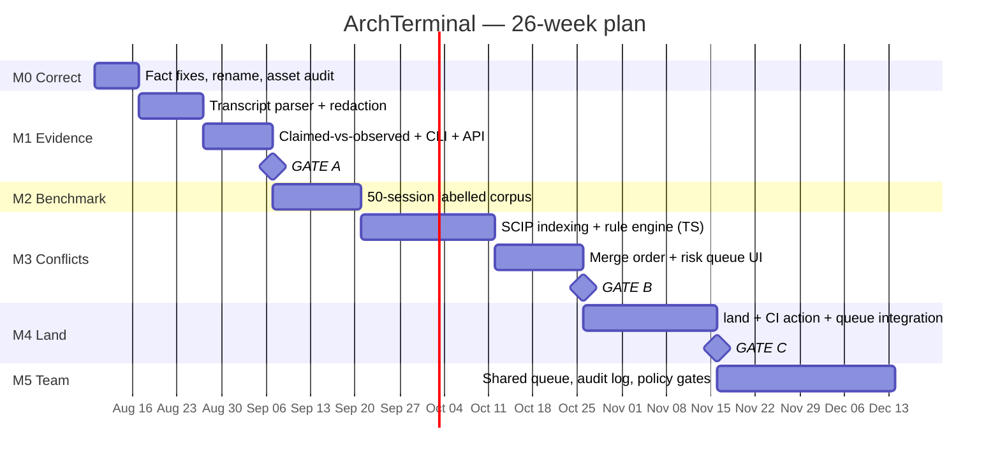

# PROJECT TRACKER — ArchTerminal

> **Single source of truth.** Current state, decisions, open work, and full history.
> **Update after every meaningful change.** Append to the Change Log; never rewrite it.

| | |
|---|---|
| **Project** | ArchTerminal (working name — see `ADR-016`, rename proposed) |
| **Tracker version** | 1.0.0 |
| **Last updated** | 2026-08-06T23:35:00Z |
| **Phase** | **Phase 0 — Correct the record** (pre-code) |
| **Lines of product code** | **0** |
| **Version control** | ❌ None — see `DEBT-007` |
| **Documents** | `ArchTerminal-Research.md`, `ArchTerminal-Review.md`, `PROJECT_TRACKER.md` |

---

## 1. Project overview

**What it is.** A **fan-in console for parallel AI coding agents.** Not a terminal, not an agent runner. It answers one question: *"Five agents finished overnight and produced five branches — which are safe to merge, in what order, and which one do I actually need to read?"*

**The problem.** The market has ~10 tools for *launching* parallel agents (fan-out) and none for *absorbing* their output (fan-in). Verified industry data: PR review time **+91%** (Faros AI, 1,255 teams), agentic PRs sit **5.3× longer** before pickup (LinearB, 8.1M PRs), AI code carries **1.7×** more issues (CodeRabbit, 470 PRs), and DORA 2025 links AI adoption to **higher delivery instability**. Generation outpaced verification.

**Two primitives.**

| | Primitive | What it does |
|---|---|---|
| **A** | **Execution provenance** | Reconciles what an agent *claimed* against what it *actually ran*. One badge: `tests claimed: yes / observed: no`. |
| **B** | **Semantic conflict prediction** | Symbol-level diff across concurrent branches. Catches renames/signature changes that merge cleanly and break `main`. |

**Surface.** One risk-ranked screen: merge these three unread, read this one, here's why — plus a suggested merge order.

**The defensible position** (narrowed from the research doc's broader claim, which did not survive verification):

> Concurrent agent branches, analysed locally, with proof of what actually executed.

**Why it holds.** Every competitor treats the agent's self-report as truth. First-party vendors (Anthropic, Cursor, Warp) **cannot** ship "your agent lied about running the tests" — it indicts their own product. That is an *incentive* gap, not a feature gap, and incentive gaps don't close on a roadmap.

**Non-goals — permanent.** Terminal emulator · VT100/ANSI parser · GPU renderer · ConPTY layer · agent orchestration/launching · merge queue · line-level code review · plugin marketplace · Docker/k8s/DB UIs · IDE.

---

## 2. Goals & roadmap

### Strategic goals

| ID | Goal | Measure |
|---|---|---|
| **G1** | Prove agents demonstrably lie about execution | Badge fires correctly on 10 real sessions, **zero false accusations** |
| **G2** | Cut agent-branch triage from ~40 min to <10 min | Measured on real 5-branch sessions |
| **G3** | Predict semantic conflicts at trustworthy precision | **≥95% precision** on the labelled benchmark |
| **G4** | Convert free users to paid teams | 3 paying teams by month 6 |
| **G5** | Stay vendor-neutral across agent providers | Claude Code, Codex, Cursor, Gemini supported equally |

### Roadmap



---

## 3. Milestones

**Legend:** ⬜ Planned · 🟡 In Progress · ✅ Completed · 🔴 Blocked · ⛔ Dropped

| ID | Milestone | Status | Target | Exit gate |
|---|---|---|---|---|
| **M0** | **Correct the record** | 🟡 **In Progress** | Wk 1 | Strategy doc corrected; CodeGraph measured on 100k LOC × 5 branches in <5 min |
| **M1** | **Evidence** (the inversion) | ⬜ Planned | Wk 2–4 | **Gate A** — badge fires correctly on 10 real sessions, **0 false accusations** |
| **M2** | **Benchmark** | ⬜ Planned | Wk 5–6 | ≥15 of 50 sessions contain a genuine semantic conflict |
| **M3** | **Conflicts** | ⬜ Planned | Wk 7–11 | **Gate B** — ≥95% precision, every flag explained in one line |
| **M4** | **Land** | ⬜ Planned | Wk 12–14 | **Gate C** — 10 external users; ≥3 caught a real conflict; ≥1 pays |
| **M5** | **Team** | ⬜ Planned | Wk 15–18+ | 3 paying teams |

### M0 detail (active)

| Task | Status |
|---|---|
| Independent verification of research doc | ✅ Completed 2026-08-06 |
| Competitor weakness teardown | ✅ Completed 2026-08-06 |
| Project tracker established | ✅ Completed 2026-08-06 |
| Correct `DEBT-001..005` in research doc | ⬜ Planned |
| **Audit CodeGraph / SuperSearch / AgentMesh** | 🔴 **Blocked** — assets not in repo (`DEBT-006`) |
| `git init` + first commit | ⬜ Planned (`DEBT-007`) |
| Rename decision | ⬜ Planned (`ADR-016`) |

> ⚠️ **M0 cannot exit while `DEBT-006` is open.** The moat argument depends on CodeGraph being real, multi-language and incremental. If it does not exist, M3 re-scopes around SCIP from scratch and the timeline grows.

---

## 4. Feature tracker

**Priority:** P0 blocking · P1 v0 · P2 v1 · P3 v2+
**Status:** ⬜ Planned · 🟡 In Progress · ✅ Done · 🔴 Blocked · ⛔ Dropped

### P0 — Blocking (before any code)

| ID | Feature | Status | Owner | Pri | Depends on |
|---|---|---|---|---|---|
| `F-001` | Invert build order: evidence before conflicts | ✅ Done | AI Review | P0 | — |
| `F-002` | Fix conflated/misattributed statistics | ⬜ Planned | Unassigned | P0 | `DEBT-001`,`DEBT-002` |
| `F-003` | Remove regulatory compliance positioning | ⬜ Planned | Unassigned | P0 | `DEBT-003` |
| `F-004` | **Audit CodeGraph / SuperSearch / AgentMesh** | 🔴 Blocked | Unassigned | P0 | `DEBT-006` |
| `F-005` | Retarget precision to ≥95% + abstention tiers | ✅ Done | AI Review | P0 | `ADR-010` |
| `F-006` | Add missed competitors to analysis | ✅ Done | AI Review | P0 | `DEBT-005` |
| `F-007` | Rename product away from "Terminal" | ⬜ Planned | Unassigned | P0 | `ADR-016`,`DEBT-010`,`Q-005` |
| `F-008` | `git init` + commit conventions | ⬜ Planned | Unassigned | P0 | `DEBT-007` |

### P1 — v0 / Evidence (M1)

| ID | Feature | Status | Owner | Pri | Depends on |
|---|---|---|---|---|---|
| `F-010` | Agent transcript parser (Claude Code JSONL) | ⬜ Planned | Unassigned | P1 | `ADR-008` |
| `F-011` | **Secret redaction at write time** (deny-by-default) | ⬜ Planned | Unassigned | P1 | `ADR-017` |
| `F-012` | Hash-chained SQLite evidence store | ⬜ Planned | Unassigned | P1 | `ADR-005`,`F-011` |
| `F-013` | **Claimed-vs-observed badge** ⭐ *core wedge* | ⬜ Planned | Unassigned | P1 | `F-010`,`F-012` |
| `F-014` | Cost / token attribution per branch | ⬜ Planned | Unassigned | P1 | `F-010` |
| `F-015` | CLI: `evidence <branch>` | ⬜ Planned | Unassigned | P1 | `F-013` |
| `F-016` | JSON output + Unix socket API | ⬜ Planned | Unassigned | P1 | `ADR-018` |
| `F-017` | Static HTML mock of risk queue, 20-dev test | ⬜ Planned | Unassigned | P1 | — |
| `F-018` | PTY capture fallback (`portable-pty`) | ⬜ Planned | Unassigned | P2 | `F-010` |

### P2 — v1 / Conflicts + Land (M2–M4)

| ID | Feature | Status | Owner | Pri | Depends on |
|---|---|---|---|---|---|
| `F-020` | 50-session labelled benchmark corpus | ⬜ Planned | Unassigned | P1 | — |
| `F-021` | SCIP indexing per branch (TypeScript first) | ⬜ Planned | Unassigned | P2 | `ADR-007` |
| `F-022` | Pre-index on worktree creation + tree-hash cache | ⬜ Planned | Unassigned | P2 | `F-021`,`ADR-020` |
| `F-023` | Rule engine: rename, signature, schema, lockfile, config drift | ⬜ Planned | Unassigned | P2 | `F-021`,`ADR-012` |
| `F-024` | Three-tier confidence (`CONFLICT`/`REVIEW`/`UNKNOWN`) | ⬜ Planned | Unassigned | P2 | `F-023`,`ADR-010` |
| `F-025` | Merge-order solver (exact, N≤10) | ⬜ Planned | Unassigned | P2 | `F-023`,`ADR-013` |
| `F-026` | Risk-ranked queue UI (local web) | ⬜ Planned | Unassigned | P2 | `F-024`,`F-017` |
| `F-027` | Branch discovery (incl. stale/rebased/abandoned) | ⬜ Planned | Unassigned | P2 | — |
| `F-028` | `land` — execute merge order with verification between steps | ⬜ Planned | Unassigned | P2 | `F-025` |
| `F-029` | in-toto / SLSA attestation export | ⬜ Planned | Unassigned | P2 | `F-012`,`ADR-011` |
| `F-030` | Shareable evidence bundle URL | ⬜ Planned | Unassigned | P2 | `F-029`,`F-011` |
| `F-031` | Publish benchmark + our score *including failures* | ⬜ Planned | Unassigned | P2 | `F-020`,`F-024` |
| `F-032` | GitHub Action / CI mode | ⬜ Planned | Unassigned | P2 | `F-024` |
| `F-033` | **Merge-queue integration + CI-minutes-saved metric** 💰 | ⬜ Planned | Unassigned | P2 | `F-032` |
| `F-034` | Adapters: Codex CLI, cmux socket, amux REST | ⬜ Planned | Unassigned | P2 | `F-010`,`F-016` |

### P3 — v2+ (M5 and beyond)

| ID | Feature | Status | Owner | Pri | Depends on |
|---|---|---|---|---|---|
| `F-040` | **Team mode**: shared queue, org audit log 💰 | ⬜ Planned | Unassigned | P3 | `F-030` |
| `F-041` | Policy gates (observed tests, zero conflicts, path rules) | ⬜ Planned | Unassigned | P3 | `F-040` |
| `F-042` | SSO | ⬜ Planned | Unassigned | P3 | `F-040` |
| `F-043` | Python + Rust language support | ⬜ Planned | Unassigned | P3 | `F-023` |
| `F-044` | Non-code conflicts: migrations, IaC, API schemas, flags | ⬜ Planned | Unassigned | P3 | `F-023` |
| `F-045` | Resolution assistance for held branches | ⬜ Planned | Unassigned | P3 | `F-024` |
| `F-046` | Monorepo-scale indexing | ⬜ Planned | Unassigned | P3 | `F-022` |
| `F-047` | Terminal surface on libghostty — **only if M1–M5 earn it** | ⬜ Planned | Unassigned | P3 | Gate C + user demand |

> ⚠️ **All owners are `Unassigned`.** Team size is an open question (`Q-002`). The M1 timeline is not a solo timeline.

---

## 5. Architecture & technical decisions (ADR)

**Status:** ✅ Accepted · 💭 Proposed · ⛔ Superseded

### System shape

```
┌──────────────────────────────────────────────────────────┐
│  Surfaces:  CLI  ·  local web UI  ·  GitHub Action · API  │
├──────────────────────────────────────────────────────────┤
│  Merge Planner       risk model · order solver · gates    │
├──────────────────────────────────────────────────────────┤
│  Conflict Engine     SCIP per branch · symbol diff        │
│                      pre-indexed, tree-hash cached        │
├──────────────────────────────────────────────────────────┤
│  Evidence Store      transcript parser · redaction        │
│                      hash-chained SQLite · SLSA export    │
├──────────────────────────────────────────────────────────┤
│  Adapters   worktrees · GitHub · Claude Code · Codex ·    │
│             cmux socket · amux REST · merge queues        │
└──────────────────────────────────────────────────────────┘
```

| ID | Decision | Status | Rationale (short) |
|---|---|---|---|
| `ADR-001` | **Do not build a terminal emulator** | ✅ | Warp open-sourced its client (MIT/AGPL, Apr 2026); libghostty embeddable. Layer 1 is a free input. Rebuilding it is the most expensive available mistake. |
| `ADR-002` | **Integrate, never replace the user's terminal** | ✅ | Switching cost is "re-learn my hands," not "download an app." Requiring a terminal switch kills the adoption curve. |
| `ADR-003` | **Local-first, privacy-first** | ✅ | Tool sits beside `.env`, AWS keys, SSH sockets. ⚠️ Anchor on latency/zero-setup/offline too — Warp Oz offers self-hosted VPC, so privacy alone is not unique. |
| `ADR-004` | **Rust engine + TypeScript UI** | ✅ | Correct for graph work and a single distributable binary. No novel native UI toolkit. |
| `ADR-005` | **SQLite, hash-chained. Not RocksDB, not a service** | ✅ | Local-first; zero infra. Trillian/Rekor is overkill for a local engine. |
| `ADR-006` | **Reject "deterministic replay"; adopt provenance + differential proof** | ✅ | Replay is undeliverable (provider serving changes, sampling, live data). Claiming it once and failing once destroys every other claim. |
| `ADR-007` | **SCIP for symbol indexing — NOT `stack-graphs`** | ✅ | `github/stack-graphs` **archived 2025-09-09**. SCIP is maintained, language-agnostic protobuf, generatable offline per branch. |
| `ADR-008` | **Transcript-first evidence; PTY as fallback** | ✅ | Agents already emit structured JSONL (`~/.claude/projects/`). PTY scraping is brittle (ANSI, TUIs, resize, missing exit codes, secret leakage). Weeks → days. |
| `ADR-009` | **Invert build order: evidence before conflicts** | ✅ | Evidence is ~2 wks, ground truth free, ~0 false-positive risk, uncontested. Conflicts are 8+ wks, contested, 15 yrs of prior art. Also de-risks cold start. |
| `ADR-010` | **≥95% precision with three-tier abstention** | ✅ | 80% is the academic *floor* (IntelliMerge 88.5%, ConflictLens 91%). Users forgive a miss, never a false alarm. Recall is negotiable; precision is not. |
| `ADR-011` | **in-toto/SLSA for export; hash-chained SQLite internally** | ✅ | Bespoke-only isolates us from CI, admission controllers, supply-chain review. Days of work for interoperability. |
| `ADR-012` | **Rule-based detection only in v1 — no ML/LLM in the detection path** | ✅ | Explainability is a hard requirement (one line per flag). Rules hit the precision target; models don't explain themselves. |
| `ADR-013` | **Exact brute-force merge-order solve (N≤10)** | ✅ | Min-feedback-arc-set is NP-hard in general, trivial at fleet size. ~1 day. Do not build a heuristic engine. |
| `ADR-014` | **Drop EU AI Act / ISO 42001 positioning** | ✅ | Art. 12 attaches to high-risk AI *products*, not internal coding assistants. ISO 42001 is a voluntary process framework. Reframe: internal governance + forensics. |
| `ADR-015` | **Depth over breadth — 3 languages well** | ✅ | Depth beats coverage in a trust product. TS → Python → Rust. |
| `ADR-016` | **Rename away from "Terminal"** | 💭 **Proposed** | The name argues against the thesis and invites the "don't replace my terminal" objection pre-feature. `land` is the good name hiding in the CLI verb. **Needs owner decision.** |
| `ADR-017` | **Secret redaction at write time, deny-by-default** | ✅ | Bundles capture shell + env. A shared URL leaking a prod credential is company-ending — in a product sold on trust. Architectural, not a feature. |
| `ADR-018` | **JSON output + socket API from the first commit** | ✅ | cmux's best idea: scriptability is how a local dev tool gets embedded and becomes hard to remove. |
| `ADR-019` | **$0 OSS core → $20/user/mo Team** | 💭 **Proposed** | Original $40–60 anchors above the whole adjacent category (Graphite $15–30, CodeRabbit $15) pre-value. Land in the existing merge-queue budget line. |
| `ADR-020` | **Pre-index on worktree creation, not on invocation** | ✅ | SCIP requires a full pass per branch; an N-branch matrix is O(N) full indexes. Hide latency in background, don't discover it in week 6. |
| `ADR-021` | **Analysis is isolation-model-agnostic** | ✅ | Worktrees are the common case; containers (Sculptor) and cloud VMs must work too. Cheap to preserve, denies competitors a differentiator. |

---

## 6. Bug & technical debt tracker

No code yet → all current debt is **documentation and process debt** in `ArchTerminal-Research.md`.

**Severity:** 🔴 Critical · 🟠 High · 🟡 Medium · 🟢 Low

| ID | Item | Sev | Status | Location | Fix |
|---|---|---|---|---|---|
| `DEBT-001` | **METR/LinearB conflation** — "-19% slower" attributed to LinearB's 8.1M PRs; it is METR's RCT, **n=16** | 🔴 | ⬜ Open | Research §0.4, §4 | Cite separately; use DORA 2025 instability finding instead |
| `DEBT-002` | **"96% don't trust AI code" misattributed** — Sonar (n=1,100), not Stack Overflow | 🟠 | ⬜ Open | Research §4 | Correct attribution |
| `DEBT-003` | **Compliance wedge misreads EU AI Act Art. 12** | 🔴 | ⬜ Open | Research §6.2, §7 | Delete; reframe per `ADR-014` |
| `DEBT-004` | **Phantom competitors** — `ittybitty`, `Superset` unverifiable | 🟡 | ⬜ Open | Research §2, §3.4, §3.5 | Remove or substantiate |
| `DEBT-005` | **Missing competitors** — Moderne (cited but not recognised as a rival), Greptile, CodeScene | 🔴 | ✅ Fixed in Review §4.2, §5.2 | Research §2, §6 | Backport to research doc |
| `DEBT-006` | **CodeGraph / SuperSearch / AgentMesh unverified** — not in repo; entire moat depends on them | 🔴 | 🔴 **Blocking M0** | — | `F-004` audit |
| `DEBT-007` | **No version control** — no git, no commit history, no backup | 🔴 | ⬜ Open | Repo root | `git init`, `.gitignore`, conventions |
| `DEBT-008` | Ghostty "~4× iTerm2" overstated as flat figure (real: 2–5×, workload-dependent) | 🟢 | ⬜ Open | Research §2, §3.7 | Soften |
| `DEBT-009` | Stale product facts — Agent Teams is experimental (env-var gated); Cursor renamed to **Cloud Agents** (cloud VMs, not local worktrees) | 🟡 | ⬜ Open | Research §2, §3.6 | Update |
| `DEBT-010` | Product name contradicts core thesis | 🟠 | ⬜ Open | Everywhere | `ADR-016` |
| `DEBT-011` | Ambiguous competitor names (`cmux`×2, `amux`×3 repos, `Conductor`×3) undisambiguated | 🟡 | ⬜ Open | Research §3 | Add disambiguation notes |
| `DEBT-012` | Missed threat class: PTY-provenance startups (Ed25519 shell ledgers, eBPF monitors) | 🟠 | ✅ Fixed in Review §5.6 | Research §9 | Backport to risk table |

---

## 7. Known limitations

| ID | Limitation | Impact | Mitigation |
|---|---|---|---|
| `LIM-001` | **Pre-code.** Zero product code exists | All timelines unvalidated | M0 gate before commitment |
| `LIM-002` | **Indexing is O(N) full passes per branch** — SCIP has no practical incremental path | Minutes, not seconds, at 5 branches | `ADR-020` pre-index in background |
| `LIM-003` | **Precision target caps recall at ~60–76%** | We will miss real conflicts | Deliberate. `UNKNOWN` tier must be visible, never silent |
| `LIM-004` | **3 languages only** (TS → Py → Rust) | Other stacks get `UNKNOWN` | `ADR-015`; never a silent false negative |
| `LIM-005` | **Transcript coverage depends on the agent emitting structured logs** | Non-emitting agents degrade to PTY fallback | `F-018` |
| `LIM-006` | **Local-only until M4** | The buyer (eng manager) lives in CI | `F-032` moved into M4 |
| `LIM-007` | **No monorepo support until v2** | Weakest exactly where agents are most useful | `F-046` |
| `LIM-008` | **Detection without resolution** — we flag and hold, we don't fix | Half a product for the held branch | `F-045` |
| `LIM-009` | **Cold start** — full value needs ≥3 parallel agents, a small population today | Slow early adoption | `ADR-009` — evidence works for a single agent |
| `LIM-010` | **Cannot prove a negative across all tooling** — we prove what a transcript shows, not everything that happened | Claims must stay narrow | Never over-claim (`ADR-006` discipline) |
| `LIM-011` | **Moat is execution + integration, not novel CS** | Feature gaps (N-way) are closable by rivals in ~2 quarters | Bank the structural gaps first (§ Review 5.7) |

---

## 8. Next priorities

**Immediate (this week — M0):**

1. 🔴 **`F-004` — Audit CodeGraph / SuperSearch / AgentMesh.** Blocking. Everything downstream assumes they exist. Measure: 100k LOC × 5 branches, <5 min.
2. 🔴 **`F-008` — `git init`.** Three documents of strategy with no version control and no backup.
3. 🟠 **`F-002`/`F-003` — Correct `DEBT-001`, `DEBT-002`, `DEBT-003`.** ~2 hours. These are checkable and wrong, in a document arguing for verification.
4. 🟠 **`F-007` — Rename decision** (`ADR-016`). Blocks all external material.
5. 🟡 **Answer `Q-002` (team size).** M1's timeline depends on it.

**Then (M1 — the inversion):** `F-010` → `F-011` → `F-012` → `F-013`. Ship the claimed-vs-observed badge publicly as a standalone single-agent product before touching conflict detection.

**Parallel, cheap, high-signal:** `F-017` — static HTML mock of the risk queue in front of 20 developers. Validates the entire thesis for a day of work.

### Open questions

| ID | Question | Blocks |
|---|---|---|
| `Q-001` | Do CodeGraph / SuperSearch / AgentMesh exist, and with what capability? | M0 exit, M3 scope |
| `Q-002` | Team size — founding team or solo? | All timelines |
| `Q-003` | Funding sought? Determines whether OSS-core + Team is viable or revenue is needed sooner | `ADR-019` |
| `Q-004` | Access to real parallel-agent sessions for `F-020`? Manufactured benchmarks measure assumptions, not reality | M2 validity |
| `Q-005` | Final product name | `ADR-016`, all external material |

---

## 9. Change Log

> **Append-only.** Newest first. Never edit or delete an existing entry — supersede it with a new one.
> No commit hashes until `DEBT-007` is resolved.

---

### `LOG-0003` — 2026-08-06T23:35:00Z

| | |
|---|---|
| **Version** | tracker `1.0.0` · commit `n/a` (`DEBT-007`) |
| **Category** | Documentation / Process |
| **Files changed** | `PROJECT_TRACKER.md` *(new)* |
| **Author** | AI (Claude, Agent SDK) |

**Summary.** Established `PROJECT_TRACKER.md` as single source of truth. Seeded 6 milestones, 40 features, 21 ADRs, 12 debt items, 11 known limitations, 5 open questions, and this log.

**Reason.** Project state was spread across two prose documents with no machine-readable status, no stable IDs, no ownership and no history. Future developers and AI agents had no way to determine current state or remaining work.

**Impact.** Every finding from the review is now a tracked item with a stable ID and dependency links. Reveals two blockers not previously visible as blockers: `DEBT-006` (unverified core assets) gates M0 exit, and `DEBT-007` (no version control) puts all existing work at risk. All feature owners are `Unassigned` pending `Q-002`.

---

### `LOG-0002` — 2026-08-06T23:34:05Z

| | |
|---|---|
| **Version** | commit `n/a` |
| **Category** | Documentation / Architecture / Strategy |
| **Files changed** | `ArchTerminal-Review.md` *(new, 585 lines)* |
| **Author** | AI (Claude, Agent SDK) |

**Summary.** Independent engineering and strategy review. Verified all 21 cited URLs programmatically (all resolve; arXiv 2606.04990 confirmed accurate). Ran six parallel research streams: Layer-1 terminals, Layer-2 orchestrators, productivity statistics, semantic-merge prior art, adjacent commercial products, implementation feasibility. Added a competitor weakness teardown ranking seven exploitable openings by durability and naming six traps.

**Reason.** The strategy was pre-code and pivot-defining; every load-bearing claim needed verification before implementation commitment.

**Impact.** **Endorsed** the core pivot away from terminal emulation. **Overturned** three load-bearing arguments: the METR/LinearB statistical conflation (`DEBT-001`), the "nobody solves semantic conflicts" moat claim (15 yrs prior art; Moderne is an unrecognised direct competitor, `DEBT-005`), and the EU AI Act compliance wedge (`DEBT-003`). **Corrected** three technical decisions: `stack-graphs` archived → SCIP (`ADR-007`), PTY scraping → transcript-first (`ADR-008`), precision 80% → 95% (`ADR-010`). **Inverted the build order** — evidence before conflicts (`ADR-009`), the single highest-leverage change. Identified the durable wedge as an *incentive* gap: first-party vendors cannot ship "your agent lied."

---

### `LOG-0001` — 2026-08-01T08:56:14Z

| | |
|---|---|
| **Version** | commit `n/a` |
| **Category** | Documentation / Strategy |
| **Files changed** | `ArchTerminal-Research.md` *(new, 445 lines)* |
| **Author** | Developer (human-directed research) |

**Summary.** Founding research and strategy document. Corrected an earlier premise that had mistaken cmux for tmux; mapped the market into three layers; teardowns of Warp/Oz, cmux, amux, worktree tools, Conductor/Sculptor, and cloud platforms; defined the fan-in wedge with two primitives (semantic conflict prediction, evidence bundles); roadmap v0–v3; architecture; risks with kill criteria; business model.

**Reason.** Decide *what* to build before writing code. The prior plan ("Warp + cmux hybrid") described a product that already shipped.

**Impact.** Established the foundational strategic decision — **do not build a terminal emulator** (`ADR-001`) — and the fan-in thesis the project now rests on. Set the non-goals list that constrains all later scope. Superseded in parts by `LOG-0002`.

---

## 10. How to update this tracker

**When.** After every feature, fix, refactor, doc update, or architectural change.

**How.**
1. Update the affected section (milestone status, feature row, ADR, debt entry).
2. **Append** a Change Log entry at the top of §9 using the template below.
3. Bump `Last updated` and, if the structure changed, `Tracker version`.
4. Never edit or delete a past log entry — supersede it with a new one referencing the old ID.

**IDs are permanent.** `M#` milestones · `F-###` features · `ADR-###` decisions · `DEBT-###` debt · `LIM-###` limitations · `Q-###` questions · `LOG-####` log. Reuse never; retire with a status change.

**Entry template:**

```markdown
### `LOG-####` — YYYY-MM-DDTHH:MM:SSZ

| | |
|---|---|
| **Version** | vX.Y.Z · commit `abc1234` |
| **Category** | Feature / Fix / Refactor / Docs / Architecture / Process / Security |
| **Files changed** | `path/one.rs`, `path/two.ts` |
| **Author** | AI (model) / Developer (name) |

**Summary.** What changed, in one or two sentences.

**Reason.** Why it was necessary. Link the driving `F-###` / `DEBT-###` / `ADR-###`.

**Impact.** What this enables, breaks, or unblocks. Note behaviour changes and new limitations.
```

**Conventions.** ISO 8601 UTC timestamps · stable IDs in every cross-reference · concise and greppable · no unverified claims (mark inference explicitly) · status emoji from the legends above.
