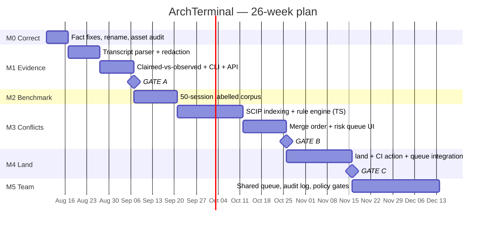

# PROJECT TRACKER — ArchTerminal

> **Single source of truth.** Current state, decisions, open work, and full history.
> **Update after every meaningful change.** Append to the Change Log; never rewrite it.

| | |
|---|---|
| **Project** | `land` (renamed from ArchTerminal — `ADR-016` accepted) |
| **Tracker version** | 1.2.0 |
| **Last updated** | 2026-08-13T02:45:00Z |
| **Phase** | **M1 — Evidence** (shipped + audited; HTML report added) |
| **Lines of product code** | **2,913** src · **632** test (40 tests) |
| **Version control** | ✅ git, `DEBT-007` closed |
| **Documents** | `README.md`, `ArchTerminal-Research.md`, `ArchTerminal-Review.md`, `PROJECT_TRACKER.md` |

---

## 1. Project overview

**What it is.** A **fan-in console for parallel AI coding agents.** Not a terminal, not an agent runner. It answers one question: *"Five agents finished overnight and produced five branches — which are safe to merge, in what order, and which one do I actually need to read?"*

**The problem.** The market has ~10 tools for *launching* parallel agents (fan-out) and none for *absorbing* their output (fan-in). Verified industry data: PR review time **+91%** (Faros AI, 1,255 teams), agentic PRs sit **5.3× longer** before pickup (LinearB, 8.1M PRs), AI code carries **1.7×** more issues (CodeRabbit, 470 PRs), and DORA 2025 links AI adoption to **higher delivery instability**. Generation outpaced verification.

**Two primitives.**

| | Primitive | Status | What it does |
|---|---|---|---|
| **A** | **Execution provenance** | ✅ **Shipped (M1)** | Reconciles what an agent *claimed* against what it *observably ran*. Four verdicts, one badge, explicit abstention. `land queue` · `land evidence`. |
| **B** | **Semantic conflict prediction** | ⬜ M3, gated on M2 | Symbol-level diff across concurrent branches. Catches renames/signature changes that merge cleanly and break `main`. Engine is CodeGraph (`ADR-023`), not new code. |

**Surface.** One risk-ranked screen: merge these three unread, read this one, here's why — plus a suggested merge order. `land queue` implements the ranking today; the merge order arrives with Primitive B.

**The defensible position** (narrowed from the research doc's broader claim, which did not survive verification):

> Concurrent agent branches, analysed locally, with proof of what actually executed.

**Why it holds.** Every competitor treats the agent's self-report as truth. First-party vendors (Anthropic, Cursor, Warp) **cannot** ship "your agent lied about running the tests" — it indicts their own product. That is an *incentive* gap, not a feature gap, and incentive gaps don't close on a roadmap.

**Non-goals — permanent.** Terminal emulator · VT100/ANSI parser · GPU renderer · ConPTY layer · agent orchestration/launching · merge queue · line-level code review · plugin marketplace · Docker/k8s/DB UIs · IDE.

---

## 2. Goals & roadmap

### Strategic goals

| ID | Goal | Measure | Status |
|---|---|---|---|
| **G1** | Prove agents demonstrably overstate execution | Badge fires correctly on 10 real sessions, **zero false accusations** | ✅ **Met** — 18 sessions, 1 true positive, 0 false accusations |
| **G2** | Cut agent-branch triage from ~40 min to <10 min | Measured on real 5-branch sessions | ⬜ Unmeasured — needs `Q-004` |
| **G3** | Predict semantic conflicts at trustworthy precision | **≥95% precision** on the labelled benchmark | ⬜ M3 |
| **G4** | Convert free users to paid teams | 3 paying teams by month 6 | ⬜ No users yet |
| **G5** | Stay vendor-neutral across agent providers | Claude Code, Codex, Cursor, Gemini supported equally | 🔴 **1 of 4** — `DEBT-017`. The moat claim currently outruns the implementation |

### Roadmap



---

## 3. Milestones

**Legend:** ⬜ Planned · 🟡 In Progress · ✅ Completed · 🔴 Blocked · ⛔ Dropped

| ID | Milestone | Status | Target | Exit gate |
|---|---|---|---|---|
| **M0** | **Correct the record** | ✅ **Completed** | Wk 1 | Assets located and audited; rename accepted; git established |
| **M1** | **Evidence** (the inversion) | ✅ **Completed** | Wk 2–4 | **Gate A passed** — see below |
| **M2** | **Benchmark** | ⬜ Planned | Wk 5–6 | ≥15 of 50 sessions contain a genuine semantic conflict |
| **M3** | **Conflicts** | ⬜ Planned | Wk 7–11 | **Gate B** — ≥95% precision, every flag explained in one line |
| **M4** | **Land** | ⬜ Planned | Wk 12–14 | **Gate C** — 10 external users; ≥3 caught a real conflict; ≥1 pays |
| **M5** | **Team** | ⬜ Planned | Wk 15–18+ | 3 paying teams |

### M0 result — the blocking unknown is resolved

| Task | Status |
|---|---|
| Independent verification of research doc | ✅ 2026-08-06 |
| Competitor weakness teardown | ✅ 2026-08-06 |
| Project tracker established | ✅ 2026-08-06 |
| Correct `DEBT-001..004`, `008`, `009` in research doc | ✅ 2026-08-13 |
| **Audit CodeGraph / SuperSearch / AgentMesh** (`F-004`) | ✅ **2026-08-13 — assets found outside the repo** |
| `git init` + `.gitignore` for source | ✅ 2026-08-13 (`DEBT-007`) |
| Rename decision | ✅ 2026-08-13 — `land` (`ADR-016`) |

**`F-004` findings.** The three assets exist on disk, outside this repo, and were audited read-only:

| Asset | Reality | Verdict |
|---|---|---|
| **CodeGraph** (`~/Desktop/contentcreation_ideas/CodeGraph`) | TypeScript monorepo, MIT. Symbol-level graph (functions, classes, resolved call edges) via `web-tree-sitter` + the TypeScript compiler API — **not** SCIP, which its docs record as designed and never built. Incremental, keyed on content hash + transitive import closure. Local `node:sqlite` storage, no server required. Already compares two revisions (`base`/`head`). Parses repositories that do not compile and have no `node_modules`. | **REUSE** — it is the M3 engine |
| **SuperSearch** (`~/Desktop/SuperSearch`) | Tauri desktop launcher with a `deno_core` V8 plugin runtime. Searches via `mdfind`/`locate`; no code index, no FTS, no symbol resolution. `Cargo.toml` declares `license = "Proprietary"`. | **IGNORE** — wrong problem, and not even licence-compatible |
| **AgentMesh** (`~/Desktop/projects/project/agentmesh`) | Go, ~11 microservices, OTLP → ClickHouse/Postgres/Redis/MinIO. Valuable *data contracts* (`docs/otlp-mapping.md` span taxonomy, replay keying) inside an infrastructure footprint that contradicts local-first. | **ADAPT the schema, discard the deployment** |

> **This inverts two accepted ADRs.** The moat asset is TypeScript and already solves the hard part; see `ADR-022` (supersedes `ADR-004`) and `ADR-023` (supersedes `ADR-007`). `LIM-002` is void.

### M1 result — Gate A evidence

Gate A: *the badge fires correctly across 10 real sessions, with zero false accusations.*

| Measure | Result |
|---|---|
| Real sessions analysed | **18** (12,972 JSONL records, `~/.claude/projects`) |
| Findings | 84 `VERIFIED` · 7 `UNKNOWN` · 1 `CONTRADICTED` |
| **False accusations** | **0** |
| True positive | An agent wrote *"Lint clean, 27 tests pass"* while `ruff` printed `Found 1 error.` The test half was true; the lint half was not. |
| Evidence store | 2,336 events, hash chain verifies; tamper detected at the mutated row with exit 2 |
| Secrets redacted at write time | 83, including a live Upstash Redis REST token |
| Tests | **40**, all passing; `tsc --noEmit` clean |
| Surfaces | terminal · self-contained HTML report · `--json` — all three from one `groupBranches` code path, asserted in tests |

**Two false accusations were found and fixed during the run**, both from treating the word "check" as test vocabulary (*"the no-duplicate-names check already passed"*, *"its gradient check passing < 1e-5"*). Both are recorded as regression comments in `src/claims.ts`. A third defect was worse than a false accusation and is recorded in `src/reconcile.ts`: a user-**denied** `npm test` was being admitted as evidence *supporting* a claim that tests passed.

**A second defect round came from auditing the shipped code and smoke-testing every surface** (`DEBT-018`–`DEBT-026`, `LOG-0006`). The three that mattered: repo grouping keyed on `basename(cwd)` merged unrelated repositories sharing a trailing directory name; the badge's `+N more` counted only same-verdict findings, so one contradiction beside seven unverifiable claims rendered no suffix at all; and `--json` reported 18 rows where the terminal reported 11 *while always exiting 0*, so the CI gate the README promised did not exist. None was visible from reading the code. All surfaced from running it and reading the output as a user would.

---

## 4. Feature tracker

**Priority:** P0 blocking · P1 v0 · P2 v1 · P3 v2+
**Status:** ⬜ Planned · 🟡 In Progress · ✅ Done · 🔴 Blocked · ⛔ Dropped

### P0 — Blocking (before any code)

| ID | Feature | Status | Owner | Pri | Depends on |
|---|---|---|---|---|---|
| `F-001` | Invert build order: evidence before conflicts | ✅ Done | AI Review | P0 | — |
| `F-002` | Fix conflated/misattributed statistics | ✅ Done | AI | P0 | `DEBT-001`,`DEBT-002` |
| `F-003` | Remove regulatory compliance positioning | ✅ Done | AI | P0 | `DEBT-003` |
| `F-004` | **Audit CodeGraph / SuperSearch / AgentMesh** | ✅ Done | AI | P0 | `DEBT-006` |
| `F-005` | Retarget precision to ≥95% + abstention tiers | ✅ Done | AI Review | P0 | `ADR-010` |
| `F-006` | Add missed competitors to analysis | ✅ Done | AI Review | P0 | `DEBT-005` |
| `F-007` | Rename product away from "Terminal" → `land` | ✅ Done | AI | P0 | `ADR-016`,`DEBT-010`,`Q-005` |
| `F-008` | `git init` + source-inclusive `.gitignore` | ✅ Done | AI | P0 | `DEBT-007` |

### P1 — v0 / Evidence (M1)

| ID | Feature | Status | Owner | Pri | Depends on |
|---|---|---|---|---|---|
| `F-010` | Agent transcript parser (Claude Code JSONL) | ✅ Done | AI | P1 | `ADR-008` |
| `F-011` | **Secret redaction at write time** (deny-by-default) | ✅ Done | AI | P1 | `ADR-017` |
| `F-012` | Hash-chained SQLite evidence store | ✅ Done | AI | P1 | `ADR-005`,`F-011` |
| `F-013` | **Claimed-vs-observed badge** ⭐ *core wedge* | ✅ Done | AI | P1 | `F-010`,`F-012` |
| `F-014` | Cost / token attribution per branch | ✅ Done | AI | P1 | `F-010` |
| `F-015` | CLI: `queue` · `evidence` · `ingest` · `verify` | ✅ Done | AI | P1 | `F-013` |
| `F-016` | JSON output on every command | ✅ Done | AI | P1 | `ADR-018` |
| `F-016b` | Unix socket API | ⬜ Planned | Unassigned | P2 | `F-016` |
| `F-017` | Risk-ranked queue surface (`land queue`) | ✅ Done | AI | P1 | `F-013` |
| `F-017b` | **Self-contained HTML report** (`land ui`) — one file, zero network requests | ✅ Done | AI | P1 | `F-017`,`ADR-026` |
| `F-017c` | **HTML escaping as a security control** (`src/html.ts`, tested) | ✅ Done | AI | P1 | `ADR-027` |
| `F-018` | PTY capture fallback | ⬜ Planned | Unassigned | P2 | `F-010` |
| `F-019` | Adapters for non-Claude agents (Codex, Cursor, opencode) | ⬜ Planned | Unassigned | P2 | `F-010`,`LIM-005` |

### P2 — v1 / Conflicts + Land (M2–M4)

| ID | Feature | Status | Owner | Pri | Depends on |
|---|---|---|---|---|---|
| `F-020` | 50-session labelled benchmark corpus | ⬜ Planned | Unassigned | P1 | — |
| `F-021` | Per-branch symbol index **via CodeGraph** (`@codegraph/core-graph`), not SCIP | ⬜ Planned | Unassigned | P2 | `ADR-023` |
| `F-022` | Pre-index on worktree creation + content-hash cache (CodeGraph already has this) | ⬜ Planned | Unassigned | P2 | `F-021`,`ADR-020` |
| `F-023` | Rule engine: rename, signature, schema, lockfile, config drift | ⬜ Planned | Unassigned | P2 | `F-021`,`ADR-012` |
| `F-024` | Three-tier confidence (`CONFLICT`/`REVIEW`/`UNKNOWN`) | ⬜ Planned | Unassigned | P2 | `F-023`,`ADR-010` |
| `F-025` | Merge-order solver (exact, N≤10) | ⬜ Planned | Unassigned | P2 | `F-023`,`ADR-013` |
| `F-026` | Risk-ranked queue UI (local web) | ⬜ Planned | Unassigned | P2 | `F-024`,`F-017` |
| `F-027` | Branch discovery (incl. stale/rebased/abandoned) | ⬜ Planned | Unassigned | P2 | — |
| `F-028` | `land` — execute merge order with verification between steps | ⬜ Planned | Unassigned | P2 | `F-025` |
| `F-029` | in-toto / SLSA attestation export | ⬜ Planned | Unassigned | P2 | `F-012`,`ADR-011` |
| `F-030` | Shareable evidence bundle — **artifact shipped as `land ui`** (`F-017b`); the *URL* half still needs `F-029` | 🟡 Partial | AI | P2 | `F-029`,`F-011` |
| `F-031` | Publish benchmark + our score *including failures* | ⬜ Planned | Unassigned | P2 | `F-020`,`F-024` |
| `F-032` | GitHub Action / CI mode | ⬜ Planned | Unassigned | P2 | `F-024` |
| `F-033` | **Merge-queue integration + CI-minutes-saved metric** 💰 | ⬜ Planned | Unassigned | P2 | `F-032` |
| `F-034` | Adapters: Codex CLI, cmux socket, amux REST | ⬜ Planned | Unassigned | P2 | `F-010`,`F-016` |

### P3 — v2+ (M5 and beyond)

| ID | Feature | Status | Owner | Pri | Depends on |
|---|---|---|---|---|---|
| `F-040` | **Team mode**: shared queue, org audit log 💰 | ⬜ Planned | Unassigned | P3 | `F-030` |
| `F-041` | Policy gates (observed tests, zero conflicts, path rules) | ⬜ Planned | Unassigned | P3 | `F-040` |
| `F-042` | SSO | ⬜ Planned | Unassigned | P3 | `F-040` |
| `F-043` | Python + Rust language support | ⬜ Planned | Unassigned | P3 | `F-023` |
| `F-044` | Non-code conflicts: migrations, IaC, API schemas, flags | ⬜ Planned | Unassigned | P3 | `F-023` |
| `F-045` | Resolution assistance for held branches | ⬜ Planned | Unassigned | P3 | `F-024` |
| `F-046` | Monorepo-scale indexing | ⬜ Planned | Unassigned | P3 | `F-022` |
| `F-047` | Terminal surface on libghostty — **only if M1–M5 earn it** | ⬜ Planned | Unassigned | P3 | Gate C + user demand |

> ⚠️ **All owners are `Unassigned`.** Team size is an open question (`Q-002`). The M1 timeline is not a solo timeline.

---

## 5. Architecture & technical decisions (ADR)

**Status:** ✅ Accepted · 💭 Proposed · ⛔ Superseded

### System shape

```
┌──────────────────────────────────────────────────────────────────┐
│  Surfaces   CLI (queue · evidence · ui · ingest · verify)     ✅  │
│             self-contained HTML report ✅ · JSON everywhere    ✅  │
│             socket API ⬜ · CI action ⬜ · shareable URL       ⬜  │
├──────────────────────────────────────────────────────────────────┤
│  Merge Planner    risk model · order solver · policy gates    ⬜  │
├──────────────────────────────────────────────────────────────────┤
│  Conflict Engine  CodeGraph symbol graph per branch (ADR-023)  ⬜ │
│                   cross-branch symbol diff · content-hash cache  │
├──────────────────────────────────────────────────────────────────┤
│  Reconciler       claim extraction · command classification   ✅  │
│  (reconcile.ts)   4 verdicts with abstention (ADR-024)            │
├──────────────────────────────────────────────────────────────────┤
│  Evidence Store   transcript parser ✅ · write-time redaction ✅   │
│  (store.ts)       hash-chained SQLite ✅ · SLSA export        ⬜   │
├──────────────────────────────────────────────────────────────────┤
│  Adapters   Claude Code ✅ · worktrees ⬜ · Codex/Cursor ⬜        │
│             GitHub ⬜ · cmux socket ⬜ · amux REST ⬜ · queues ⬜   │
└──────────────────────────────────────────────────────────────────┘
```

| ID | Decision | Status | Rationale (short) |
|---|---|---|---|
| `ADR-001` | **Do not build a terminal emulator** | ✅ | Warp open-sourced its client (MIT/AGPL, Apr 2026); libghostty embeddable. Layer 1 is a free input. Rebuilding it is the most expensive available mistake. |
| `ADR-002` | **Integrate, never replace the user's terminal** | ✅ | Switching cost is "re-learn my hands," not "download an app." Requiring a terminal switch kills the adoption curve. |
| `ADR-003` | **Local-first, privacy-first** | ✅ | Tool sits beside `.env`, AWS keys, SSH sockets. ⚠️ Anchor on latency/zero-setup/offline too — Warp Oz offers self-hosted VPC, so privacy alone is not unique. |
| `ADR-004` | ~~Rust engine + TypeScript UI~~ | ⛔ **Superseded by `ADR-022`** | Assumed the engine had to be written. `F-004` found the engine already exists in TypeScript. |
| `ADR-005` | **SQLite, hash-chained. Not RocksDB, not a service** | ✅ | Local-first; zero infra. Trillian/Rekor is overkill for a local engine. |
| `ADR-006` | **Reject "deterministic replay"; adopt provenance + differential proof** | ✅ | Replay is undeliverable (provider serving changes, sampling, live data). Claiming it once and failing once destroys every other claim. |
| `ADR-007` | ~~SCIP for symbol indexing~~ | ⛔ **Superseded by `ADR-023`** | Correct that `stack-graphs` is archived; wrong that SCIP is the replacement. See `ADR-023`. |
| `ADR-008` | **Transcript-first evidence; PTY as fallback** | ✅ | Agents already emit structured JSONL (`~/.claude/projects/`). PTY scraping is brittle (ANSI, TUIs, resize, missing exit codes, secret leakage). Weeks → days. |
| `ADR-009` | **Invert build order: evidence before conflicts** | ✅ | Evidence is ~2 wks, ground truth free, ~0 false-positive risk, uncontested. Conflicts are 8+ wks, contested, 15 yrs of prior art. Also de-risks cold start. |
| `ADR-010` | **≥95% precision with three-tier abstention** | ✅ | 80% is the academic *floor* (IntelliMerge 88.5%, ConflictLens 91%). Users forgive a miss, never a false alarm. Recall is negotiable; precision is not. |
| `ADR-011` | **in-toto/SLSA for export; hash-chained SQLite internally** | ✅ | Bespoke-only isolates us from CI, admission controllers, supply-chain review. Days of work for interoperability. |
| `ADR-012` | **Rule-based detection only in v1 — no ML/LLM in the detection path** | ✅ | Explainability is a hard requirement (one line per flag). Rules hit the precision target; models don't explain themselves. |
| `ADR-013` | **Exact brute-force merge-order solve (N≤10)** | ✅ | Min-feedback-arc-set is NP-hard in general, trivial at fleet size. ~1 day. Do not build a heuristic engine. |
| `ADR-014` | **Drop EU AI Act / ISO 42001 positioning** | ✅ | Art. 12 attaches to high-risk AI *products*, not internal coding assistants. ISO 42001 is a voluntary process framework. Reframe: internal governance + forensics. |
| `ADR-015` | **Depth over breadth — 3 languages well** | ✅ | Depth beats coverage in a trust product. TS → Python → Rust. |
| `ADR-016` | **Rename to `land`** | ✅ **Accepted** | The old name argued against the thesis and invited the "don't replace my terminal" objection before a single feature. `land` was already the CLI verb. Cost of reversal: one package rename. |
| `ADR-017` | **Secret redaction at write time, deny-by-default** | ✅ | Bundles capture shell + env. A shared URL leaking a prod credential is company-ending — in a product sold on trust. Architectural, not a feature. |
| `ADR-018` | **JSON output + socket API from the first commit** | ✅ | cmux's best idea: scriptability is how a local dev tool gets embedded and becomes hard to remove. |
| `ADR-019` | **$0 OSS core → $20/user/mo Team** | 💭 **Proposed** | Original $40–60 anchors above the whole adjacent category (Graphite $15–30, CodeRabbit $15) pre-value. Land in the existing merge-queue budget line. |
| `ADR-020` | **Pre-index on worktree creation, not on invocation** | ✅ | Still right, but cheaper than assumed: CodeGraph already caches per-file extractions by content hash + transitive import closure, so an N-branch matrix is not N full passes. |
| `ADR-021` | **Analysis is isolation-model-agnostic** | ✅ | Worktrees are the common case; containers (Sculptor) and cloud VMs must work too. Cheap to preserve, denies competitors a differentiator. |
| `ADR-022` | **TypeScript on Node ≥22.6 for the whole engine — not Rust** | ✅ **Accepted 2026-08-13**, supersedes `ADR-004` | `ADR-004` was decided when CodeGraph was an unverified claim. It is real, MIT, TypeScript, and already does symbol-level cross-revision analysis on uncompilable code. A Rust engine means reimplementing the one asset that already works — the same category of error as `ADR-001`. Node 25 also removes the dependency argument: `node:sqlite`, `node:test` and native TS execution ship with the runtime, so the evidence engine has **zero runtime dependencies**. Cost: no single static binary today (`bun build --compile` or Node SEA when distribution demands it). |
| `ADR-023` | **Symbol indexing via CodeGraph (tree-sitter + TS compiler API) — not SCIP** | ✅ **Accepted 2026-08-13**, supersedes `ADR-007` | SCIP indexers generally need a resolvable build; an agent worktree usually has neither `node_modules` nor a clean compile, which is **the normal state of the artifact we analyse** — and per Review §5.2 that is precisely the structural weakness we exploit against Moderne. Adopting SCIP would have imported the competitor's constraint. CodeGraph parses degraded trees and falls back to syntactic heuristics. Keep SCIP as a possible *export* format, never as the ingestion path. |
| `ADR-024` | **Abstain rather than accuse, in four named verdicts** | ✅ **Accepted 2026-08-13** | Implements `ADR-010` for the evidence primitive. `UNSUPPORTED`/`CONTRADICTED` require every escape route closed: shell access demonstrably used, no matching command anywhere, no user-denied command, and no opaque code-executing tool in the session. Otherwise `UNKNOWN`, stated plainly. Validated at 0 false accusations over 18 real sessions. |
| `ADR-025` | **Store observations, derive verdicts** | ✅ **Accepted 2026-08-13** | Only observations enter the hash chain. Verdicts are recomputed on read, so an opinion can never drift from the evidence it describes, and improving the reconciler never invalidates stored history. Tamper-evidence belongs on the source, not on a conclusion about it. |
| `ADR-026` | **The UI is one self-contained HTML document, server-rendered by the CLI. No SPA framework, no bundler, no CSS framework, no webfonts.** | ✅ **Accepted 2026-08-13** | `F-030` (send a reviewer *proof*, not a diff) requires a shared artifact that opens with no server, no install, offline, in five years, making **zero network requests** — a bundle that phones home is disqualifying for a privacy-first forensic tool. Only a single inlined HTML file satisfies that. Once it exists, an SPA for the local view is duplicated work: `land ui` and `land share` render the same document from the same code path. Second reason is the threat model: the engine has **0 runtime dependencies** and reads shell output from beside `.env` files and SSH sockets; React + Next + Tailwind + shadcn would add ~300 transitive packages of supply-chain surface to a security product. Bug count tracks dependency count and build-config surface, and both are zero here. Cost: no component ecosystem, and all UI is hand-written — acceptable because the entire surface is **one screen** (`§1`), which is a product constraint, not a stage. Revisit only if the surface grows past ~3 views or needs live-updating state. |
| `ADR-027` | **HTML escaping is a security control, not a formatting detail** | ✅ **Accepted 2026-08-13** | Evidence bundles embed agent shell commands and captured output, then get **sent to another human**. Unescaped output is stored XSS with a delivery mechanism. Every interpolation goes through one escaper, tested against `</script>`, attribute breakouts and `javascript:` URLs; the document sets a restrictive `Content-Security-Policy` meta and carries no inline event handlers. This is why templating stays hand-written and auditable rather than assembled from string concatenation scattered across modules. |
| `ADR-028` | **Aesthetic direction: forensic instrument. Testimony in serif, evidence in monospace.** | ✅ **Accepted 2026-08-13** | The `ui-ux-pro-max` database recommended "Modern Dark (Cinema Mobile)" — glassmorphism, blur, indigo glow, Inter via Google Fonts CDN. Rejected: the CDN import breaks self-containment (`ADR-026`), and blur/glow is a mobile-media aesthetic on a document whose job is to look like a *record*. **Its structural rules were kept**: dark primary, dense spacing scale, no pure `#000`, AA contrast on accents, visible focus, `prefers-reduced-motion`, SVG not emoji. The direction instead: near-monochrome, hairline rules, tabular numerals, one saturated colour on screen at a time (the verdict). The organising idea is a court exhibit — what the agent *said* is set in serif, what was *observed* is set in monospace, so the two are never visually confusable. Type comes from system stacks only, per `ADR-026`. |

---

## 6. Bug & technical debt tracker

Documentation debt from the review is now closed. New entries below it are **code** debt discovered while building M1.

**Severity:** 🔴 Critical · 🟠 High · 🟡 Medium · 🟢 Low

| ID | Item | Sev | Status | Location | Fix |
|---|---|---|---|---|---|
| `DEBT-001` | **METR/LinearB conflation** — "−19% slower" attributed to LinearB's 8.1M PRs; it is METR's RCT, **n=16** | 🔴 | ✅ **Fixed 2026-08-13** | Research §0.4, §4 | Cited separately; DORA 2025 instability finding added |
| `DEBT-002` | **"96% don't trust AI code" misattributed** — Sonar (n=1,100), not Stack Overflow | 🟠 | ✅ **Fixed 2026-08-13** | Research §4 | Attribution corrected; SO 2025 figures noted alongside |
| `DEBT-003` | **Compliance wedge misreads EU AI Act Art. 12** | 🔴 | ✅ **Fixed 2026-08-13** | Research §6.2, §7 | Deleted; reframed per `ADR-014` |
| `DEBT-004` | **Phantom competitors** — `ittybitty`, `Superset` unverifiable | 🟡 | ✅ **Fixed 2026-08-13** | Research §2, §3.4, §3.5 | Removed; tool count corrected |
| `DEBT-005` | **Missing competitors** — Moderne (cited but not recognised as a rival), Greptile, CodeScene | 🔴 | ✅ Fixed in Review §4.2, §5.2 | Research §2, §6 | Backport to research doc |
| `DEBT-006` | **CodeGraph / SuperSearch / AgentMesh unverified** — entire moat depended on them | 🔴 | ✅ **Resolved 2026-08-13** | — | Audited (`F-004`). CodeGraph REUSE · AgentMesh ADAPT · SuperSearch IGNORE. Drove `ADR-022`, `ADR-023` |
| `DEBT-007` | **No version control** | 🔴 | ✅ **Fixed 2026-08-13** | Repo root | git established; `.gitignore` no longer excludes all source |
| `DEBT-008` | Ghostty "~4× iTerm2" overstated as flat figure (real: 2–5×, workload-dependent) | 🟢 | ✅ **Fixed 2026-08-13** | Research §2, §3.7 | Softened |
| `DEBT-009` | Stale product facts — Agent Teams env-var gated; Cursor renamed **Cloud Agents** | 🟡 | ✅ **Fixed 2026-08-13** | Research §2, §3.6 | Updated |
| `DEBT-010` | Product name contradicts core thesis | 🟠 | ✅ **Fixed 2026-08-13** | Everywhere | Renamed `land` (`ADR-016`) |
| `DEBT-011` | Ambiguous competitor names (`cmux`×2, `amux`×3 repos, `Conductor`×3) undisambiguated | 🟡 | ⬜ Open | Research §3 | Add disambiguation notes |
| `DEBT-012` | Missed threat class: PTY-provenance startups (Ed25519 shell ledgers, eBPF monitors) | 🟠 | ✅ Fixed in Review §5.6 | Research §9 | Backport to risk table |
| `DEBT-013` | **Claim extraction is regex on prose.** Precision guards are empirical, tuned against one 18-session corpus. A different writing style will surface new false positives | 🟠 | ⬜ Open | `src/claims.ts` | Every new false positive becomes a named regression comment + fixture. Revisit only if the guard list stops converging |
| `DEBT-014` | **`land ingest` re-reads and re-parses every transcript on each run**; skip is decided after parsing | 🟡 | ⬜ Open | `src/store.ts`, `src/cli.ts` | Record source file size + mtime per session and skip before parse |
| `DEBT-015` | **No `.land/` store is written by `queue`/`evidence`** — they parse live each time, so there is no cross-machine or historical view | 🟡 | ⬜ Open | `src/cli.ts` | Read from the store when present, fall back to live parse |
| `DEBT-016` | **`opaqueExecutors` triggers session-wide abstention**, not per-activity. One MCP eval tool suppresses accusations about lint as well as tests | 🟡 | ⬜ Open | `src/reconcile.ts` | Acceptable while precision is the binding constraint; narrow when recall starts mattering |
| `DEBT-017` | **Single-agent format only.** Codex, Cursor (SQLite `state.vscdb`), opencode (SQLite), Aider (markdown) are unsupported, so `LIM-005` bites immediately outside Claude Code | 🟠 | ⬜ Open | `src/transcript.ts` | `F-019`; the `Session` type is already format-agnostic |
| `DEBT-018` | **Branch names were rendered unsanitised.** Git emits coloured names via `color.branch`; an embedded ANSI reset terminated styling early and the escape bytes counted toward padding width | 🟡 | ✅ **Fixed 2026-08-13** | `src/render.ts` | `stripAnsi` before grouping; truncate to terminal width |
| `DEBT-019` | **Repo grouping keyed on `basename(cwd)`.** Two repos sharing a trailing directory name (`client/app`, `server/app`) merged into one row and reported a single verdict for unrelated work | 🟠 | ✅ **Fixed 2026-08-13** | `src/reconcile.ts`, `src/render.ts` | Key on full `cwd`; label with the shortest unique suffix (`DEBT-023`) |
| `DEBT-020` | **Transcript reads had no I/O error boundary.** A transcript deleted between discovery and read raised an unhandled rejection and killed the process mid-run | 🟠 | ✅ **Fixed 2026-08-13** | `src/transcript.ts` | `try`/`catch` around stream creation and the read loop; return partial evidence |
| `DEBT-021` | **Badge `+N more` counted only same-verdict findings.** One contradiction beside seven unverifiable claims rendered no suffix at all, so a reader infers one finding total | 🟠 | ✅ **Fixed 2026-08-13** | `src/reconcile.ts` | `N of M claims` — both numbers stated, neither implied |
| `DEBT-022` | **Redaction missed 12 modern platform credential families** (Supabase, GitLab, SendGrid, Twilio, Linear, DigitalOcean, Shopify, Figma, Groq, OpenRouter, xAI, Doppler) | 🟠 | ✅ **Fixed 2026-08-13** | `src/redact.ts` | Distinctive-prefix rules only; shape-plus-nearby-word rules rejected as false-positive machines |
| `DEBT-023` | **First fix for `DEBT-019` traded one defect for another.** Labelling with `relative(cwd, …)` rendered `../../../Users/me/Desktop/…` from `/tmp`, changed with the caller's location, and leaked the reviewer's home directory into a shared HTML report | 🟠 | ✅ **Fixed 2026-08-13** | `src/reconcile.ts` | `shortestUniqueLabels` — grows each path only as far as *that* path needs; cwd-independent |
| `DEBT-024` | **Three surfaces recomputed grouping independently.** `renderQueue` reimplemented what `groupBranches` owned and `reconcile.ts` documents as shared "deliberately" | 🟠 | ✅ **Fixed 2026-08-13** | `src/render.ts` | Deleted 46 lines; `renderQueue` consumes `groupBranches` |
| `DEBT-025` | **`land queue --json` reported sessions under a key named `branches`** — 18 rows against the terminal's 11 for identical input | 🟠 | ✅ **Fixed 2026-08-13** | `src/cli.ts` | Consumes `groupBranches`; invariant asserted in tests |
| `DEBT-026` | **`--json` always exited 0**, so the CI gate the README promises did not exist: piping to a machine consumer silently disabled the signal | 🔴 | ✅ **Fixed 2026-08-13** | `src/cli.ts` | Exit code is now format-independent |

---

## 7. Known limitations

| ID | Limitation | Impact | Mitigation |
|---|---|---|---|
| `LIM-001` | ~~Pre-code~~ | M1 shipped and measured; M2–M5 timelines still unvalidated | Gate evidence recorded per milestone |
| `LIM-002` | ~~Indexing is O(N) full passes per branch~~ — **void.** Premised on SCIP; CodeGraph caches by content hash + import closure | — | `ADR-023` |
| `LIM-003` | **Precision target caps recall at ~60–76%** | We will miss real conflicts | Deliberate. `UNKNOWN` tier must be visible, never silent |
| `LIM-004` | **3 languages only** (TS → Py → Rust) | Other stacks get `UNKNOWN` | `ADR-015`; never a silent false negative |
| `LIM-005` | **Transcript coverage depends on the agent emitting structured logs** | Non-emitting agents degrade to PTY fallback | `F-018` |
| `LIM-006` | **Local-only until M4** | The buyer (eng manager) lives in CI | `F-032` moved into M4 |
| `LIM-007` | **No monorepo support until v2** | Weakest exactly where agents are most useful | `F-046` |
| `LIM-008` | **Detection without resolution** — we flag and hold, we don't fix | Half a product for the held branch | `F-045` |
| `LIM-009` | **Cold start** — full value needs ≥3 parallel agents, a small population today | Slow early adoption | `ADR-009` — evidence works for a single agent |
| `LIM-010` | **Cannot prove a negative across all tooling** — we prove what a transcript shows, not everything that happened | Claims must stay narrow | Never over-claim (`ADR-006` discipline) |
| `LIM-011` | **Moat is execution + integration, not novel CS** | Feature gaps (N-way) are closable by rivals in ~2 quarters | Bank the structural gaps first (§ Review 5.7) |

---

## 8. Next priorities

**M1 is shipped and measured. The next binding constraint is not code — it is evidence that the conflict thesis is real.**

1. 🔴 **`F-020` — the 50-session labelled corpus (M2).** This is the gate that can *kill* the M3 plan cheaply, and it is now the only thing standing between us and eleven weeks of engine work. `Q-004` is its prerequisite and is still unanswered: the development corpus contains 18 sessions across 11 branches but **no genuine parallel-agent session**, so we currently have no evidence that concurrent agent branches collide in practice. Do not start `F-021` before this.
2. 🟠 **`DEBT-017` / `F-019` — a second agent format.** The wedge is vendor-neutrality (`G5`, Review §5.7 rank 6) and we support exactly one vendor. Codex CLI or opencode next; both are cheap because `Session` is already format-agnostic.
3. 🟠 **Put `land` in front of real users.** The product is usable today and answers a real question for a *single* agent, which is `ADR-009`'s entire argument and the fix for `LIM-009`. Shipping now also grows the corpus `F-020` needs.
4. 🟡 **`DEBT-014`/`DEBT-015` — make the store load-bearing.** `queue` and `evidence` currently re-parse from scratch and ignore the database they can write, so the hash chain is a feature nothing consumes yet.
5. 🟡 **`F-016b` — socket API.** Review §5.5: this is how `land` becomes the verification pane inside cmux/amux rather than another thing to open.

**Explicitly not next:** `F-021` (conflict engine). It is eleven weeks gated behind a benchmark we have not built, and `ADR-009` exists precisely to stop us starting it early.

### Open questions

| ID | Question | Blocks |
|---|---|---|
| `Q-001` | ~~Do CodeGraph / SuperSearch / AgentMesh exist?~~ | ✅ Answered by `F-004` — see M0 result |
| `Q-002` | Team size — founding team or solo? | All timelines |
| `Q-003` | Funding sought? Determines whether OSS-core + Team is viable or revenue is needed sooner | `ADR-019` |
| `Q-004` | 🔴 **Access to real parallel-agent sessions.** Now the top open question. The corpus has 11 branches but no concurrent-agent run; a manufactured benchmark would measure our assumptions, not reality | M2 validity, all of M3 |
| `Q-005` | ~~Final product name~~ | ✅ `land` (`ADR-016`) |
| `Q-006` | Is `CONTRADICTED` too harsh for premature claims? The one true positive found was an agent saying "lint clean" moments before it became true — accurate, but is "the agent lied" the right frame for it? | Wording of the badge, `ADR-024` |

---

## 9. Change Log

> **Append-only.** Newest first. Never edit or delete an existing entry — supersede it with a new one.

---

### `LOG-0006` — 2026-08-13T02:45:00Z

| | |
|---|---|
| **Version** | tracker `1.2.0` · `land` `0.1.0` |
| **Category** | Feature / Security / Fix |
| **Files changed** | `src/html.ts` *(new)*, `src/report.ts` *(new)*, `src/cli.ts`, `src/reconcile.ts`, `src/redact.ts`, `src/render.ts`, `src/transcript.ts`, `test/html.test.ts` *(new)*, `test/reconcile.test.ts`, `test/store.test.ts`, `README.md`, `PROJECT_TRACKER.md` |
| **Author** | AI (Claude, Agent SDK) |

**Summary.** Added `land ui` — a self-contained HTML evidence report (`ADR-026`–`ADR-028`) — then audited the whole codebase in parallel and fixed every real defect found. Still zero runtime dependencies. 40 tests.

**Reason.** `F-030` requires a shareable artifact: an evidence bundle is a court exhibit, and a reviewer who must install a tool to read it will not read it. The audit was the `Understand → Audit → Refine` half of the brief; four read-only agents covered transcript parsing, claim extraction, security, and reconciliation.

**The report is a security boundary, not a formatting concern.** It embeds agent shell commands and their captured output and is then *sent to another human*. Unescaped output is stored XSS with a delivery mechanism. So `src/html.ts` is a tagged template that escapes every interpolation unless explicitly marked `trusted()`, `jsonScriptPayload()` neutralises the `</script>` break-out that JSON quoting does not cover, and nothing in the codebase concatenates markup by hand. CSP is `default-src 'none'`; the emitted document makes zero network requests — verified on the real corpus, where the only URLs present are inside displayed command text, correctly escaped.

**Three UI defects fixed by looking at it in a browser rather than reasoning about it.** (1) The tally counted branches by *worst* verdict, so a corpus with 84 verified claims rendered **"Verified 0"** — technically true, completely misleading, in the one place a reader looks for a summary; it now counts claims. (2) Branch names broke mid-path (`Action_classification/` / `HEAD`) instead of truncating. (3) The background grid cut visible lines through the masthead.

**Ten defects found by the audit and the smoke test.** `DEBT-018`–`DEBT-026`, plus the badge-count honesty bug. The two worth naming: repo grouping keyed on `basename(cwd)`, so `client/app` and `server/app` merged into one row and reported a single verdict for unrelated work; and the badge's `+N more` counted only same-verdict findings, so one contradiction beside seven unverifiable claims rendered *no suffix at all*. The real corpus now reads `(1 of 31 claims)` — both numbers stated, neither implied. **Four of the ten were introduced or exposed by the earlier fixes in this same entry** — which is the argument for smoke-testing every surface after every change, not only the one that was edited.

**Redaction widened to 12 modern platform credential families.** Every rule matches a *distinctive prefix*. Shape-plus-nearby-word rules (a 24-char token near the word "vercel") were written, tested, and rejected: they fire on git SHAs and base64 chunks, and a redactor that mangles ordinary output teaches users to ignore the marker — which costs more than the gap it closes. Providers without a distinctive prefix remain covered by the `SENSITIVE_KEY` assignment rule and the entropy sweep.

**Impact.** Re-ingesting the real corpus produces 83 redactions — identical to the `LOG-0005` baseline — confirming the new rules added coverage without a single false positive on real data. Chain verifies at 2,336 events. `tsc --noEmit` clean. Gate A results unchanged: still 0 false accusations.

**Behaviour change.** `land queue` labels are now qualified with the shortest repository suffix that stays unambiguous (`Action_classification/HEAD`) rather than a bare branch name, because `HEAD` and `main` recur across every repository on a machine.

**Superseded within this entry.** The first labelling fix used `relative(cwd, …)` and was itself defective — see `DEBT-023`–`DEBT-026`, fixed in the same session: cwd-dependent labels, three surfaces recomputing grouping, `--json` reporting sessions under a `branches` key, and `--json` never setting a non-zero exit code.

---

### `LOG-0005` — 2026-08-13T00:00:00Z

| | |
|---|---|
| **Version** | tracker `1.1.0` · `land` `0.1.0` |
| **Category** | Feature / Architecture / Security |
| **Files changed** | `src/{transcript,commands,claims,reconcile,redact,store,discover,render,cli}.ts` *(new, 1,946 lines)*, `test/{fixtures,reconcile.test,store.test}.ts` *(new, 406 lines)*, `README.md` *(new)*, `package.json`, `tsconfig.json`, `.gitignore`, `PROJECT_TRACKER.md` |
| **Author** | AI (Claude, Agent SDK) |

**Summary.** Shipped M1: `land`, a working CLI that reconciles what an agent claimed against what it observably ran. Four commands (`queue`, `evidence`, `ingest`, `verify`), JSON on all of them, write-time secret redaction, a hash-chained append-only SQLite evidence store, and 23 tests. Zero runtime dependencies — `node:sqlite`, `node:test` and native TS execution come with the runtime.

**Reason.** `ADR-009` put evidence before conflicts. `F-010`–`F-017`.

**Impact — Gate A passed.** 18 real sessions: 84 `VERIFIED`, 7 `UNKNOWN`, 1 `CONTRADICTED` (true positive: an agent wrote *"Lint clean, 27 tests pass"* while `ruff` printed `Found 1 error.`), **0 false accusations**. 2,336 chained events; tamper detected at the mutated row. 83 secrets redacted before write, including a live Upstash Redis REST token.

**Three schema findings that constrain what the product may claim,** none documented upstream: Claude Code records **no exit code** (failure carries `is_error` plus an `Exit code N` content prefix; success carries neither, so exit 0 is inferred); there is **no test tool**, so `cargo test 2>&1 | tail` exits with `tail`'s status and pass/fail must come from the runner's own summary *scoped to the activity*; and a `tool_result` can mean **the user declined**, which is a non-execution.

**Four defects found by running it, not by reading it.** (1) Two false accusations from treating "check" as test vocabulary — fixed, recorded as regression comments in `src/claims.ts`. (2) A user-**denied** `npm test` was admitted as evidence *supporting* a claim — worse than a false accusation, because a false `VERIFIED` is never re-examined. (3) `2>&1` was parsed as a shell separator, which truncated pipelines and made masked exit statuses look authoritative. (4) `ruff`'s `Found 1 error.` was attributed to `pytest` in the same invocation, producing a false `CONTRADICTED`; output signs are now per-activity. Also: `process.exit()` silently truncated piped `--json` output.

**New debt.** `DEBT-013`–`DEBT-017`. The honest ones: claim extraction is regex on prose tuned against a single corpus, and only one agent format is supported while vendor-neutrality is the moat.

---

### `LOG-0004` — 2026-08-13T00:00:00Z

| | |
|---|---|
| **Version** | tracker `1.1.0` |
| **Category** | Architecture / Process |
| **Files changed** | `PROJECT_TRACKER.md`, `ArchTerminal-Research.md`, `.gitignore` |
| **Author** | AI (Claude, Agent SDK) |

**Summary.** Closed M0. Located and audited the three claimed assets, which were never in this repo. Accepted the rename to `land`. Corrected `DEBT-001`–`DEBT-004`, `DEBT-008`, `DEBT-009` in the research document. Replaced a `.gitignore` that excluded every non-Markdown file — it would have silently refused to track any source code.

**Reason.** `DEBT-006` blocked M0 exit and the entire moat argument rested on it. `F-004`, `F-002`, `F-003`, `F-007`, `F-008`.

**Impact — the audit inverted two accepted decisions.** CodeGraph is real: TypeScript, MIT, symbol-level via tree-sitter plus the TypeScript compiler API, incrementally cached by content hash, local SQLite, already able to compare two revisions, and able to parse repositories that do not compile. Therefore `ADR-022` supersedes `ADR-004` (a Rust engine would mean reimplementing the working asset) and `ADR-023` supersedes `ADR-007` (SCIP needs a resolvable build, which agent worktrees do not have — adopting it would have imported the exact constraint we exploit against Moderne). `LIM-002` is void. SuperSearch is `IGNORE` and is additionally licensed `Proprietary`; AgentMesh contributes its span taxonomy and nothing else.

---

### `LOG-0003` — 2026-08-06T23:35:00Z

| | |
|---|---|
| **Version** | tracker `1.0.0` · commit `n/a` (`DEBT-007`) |
| **Category** | Documentation / Process |
| **Files changed** | `PROJECT_TRACKER.md` *(new)* |
| **Author** | AI (Claude, Agent SDK) |

**Summary.** Established `PROJECT_TRACKER.md` as single source of truth. Seeded 6 milestones, 40 features, 21 ADRs, 12 debt items, 11 known limitations, 5 open questions, and this log.

**Reason.** Project state was spread across two prose documents with no machine-readable status, no stable IDs, no ownership and no history. Future developers and AI agents had no way to determine current state or remaining work.

**Impact.** Every finding from the review is now a tracked item with a stable ID and dependency links. Reveals two blockers not previously visible as blockers: `DEBT-006` (unverified core assets) gates M0 exit, and `DEBT-007` (no version control) puts all existing work at risk. All feature owners are `Unassigned` pending `Q-002`.

---

### `LOG-0002` — 2026-08-06T23:34:05Z

| | |
|---|---|
| **Version** | commit `n/a` |
| **Category** | Documentation / Architecture / Strategy |
| **Files changed** | `ArchTerminal-Review.md` *(new, 585 lines)* |
| **Author** | AI (Claude, Agent SDK) |

**Summary.** Independent engineering and strategy review. Verified all 21 cited URLs programmatically (all resolve; arXiv 2606.04990 confirmed accurate). Ran six parallel research streams: Layer-1 terminals, Layer-2 orchestrators, productivity statistics, semantic-merge prior art, adjacent commercial products, implementation feasibility. Added a competitor weakness teardown ranking seven exploitable openings by durability and naming six traps.

**Reason.** The strategy was pre-code and pivot-defining; every load-bearing claim needed verification before implementation commitment.

**Impact.** **Endorsed** the core pivot away from terminal emulation. **Overturned** three load-bearing arguments: the METR/LinearB statistical conflation (`DEBT-001`), the "nobody solves semantic conflicts" moat claim (15 yrs prior art; Moderne is an unrecognised direct competitor, `DEBT-005`), and the EU AI Act compliance wedge (`DEBT-003`). **Corrected** three technical decisions: `stack-graphs` archived → SCIP (`ADR-007`), PTY scraping → transcript-first (`ADR-008`), precision 80% → 95% (`ADR-010`). **Inverted the build order** — evidence before conflicts (`ADR-009`), the single highest-leverage change. Identified the durable wedge as an *incentive* gap: first-party vendors cannot ship "your agent lied."

---

### `LOG-0001` — 2026-08-01T08:56:14Z

| | |
|---|---|
| **Version** | commit `n/a` |
| **Category** | Documentation / Strategy |
| **Files changed** | `ArchTerminal-Research.md` *(new, 445 lines)* |
| **Author** | Developer (human-directed research) |

**Summary.** Founding research and strategy document. Corrected an earlier premise that had mistaken cmux for tmux; mapped the market into three layers; teardowns of Warp/Oz, cmux, amux, worktree tools, Conductor/Sculptor, and cloud platforms; defined the fan-in wedge with two primitives (semantic conflict prediction, evidence bundles); roadmap v0–v3; architecture; risks with kill criteria; business model.

**Reason.** Decide *what* to build before writing code. The prior plan ("Warp + cmux hybrid") described a product that already shipped.

**Impact.** Established the foundational strategic decision — **do not build a terminal emulator** (`ADR-001`) — and the fan-in thesis the project now rests on. Set the non-goals list that constrains all later scope. Superseded in parts by `LOG-0002`.

---

## 10. How to update this tracker

**When.** After every feature, fix, refactor, doc update, or architectural change.

**How.**
1. Update the affected section (milestone status, feature row, ADR, debt entry).
2. **Append** a Change Log entry at the top of §9 using the template below.
3. Bump `Last updated` and, if the structure changed, `Tracker version`.
4. Never edit or delete a past log entry — supersede it with a new one referencing the old ID.

**IDs are permanent.** `M#` milestones · `F-###` features · `ADR-###` decisions · `DEBT-###` debt · `LIM-###` limitations · `Q-###` questions · `LOG-####` log. Reuse never; retire with a status change.

**Entry template:**

```markdown
### `LOG-####` — YYYY-MM-DDTHH:MM:SSZ

| | |
|---|---|
| **Version** | vX.Y.Z · commit `abc1234` |
| **Category** | Feature / Fix / Refactor / Docs / Architecture / Process / Security |
| **Files changed** | `path/one.rs`, `path/two.ts` |
| **Author** | AI (model) / Developer (name) |

**Summary.** What changed, in one or two sentences.

**Reason.** Why it was necessary. Link the driving `F-###` / `DEBT-###` / `ADR-###`.

**Impact.** What this enables, breaks, or unblocks. Note behaviour changes and new limitations.
```

**Conventions.** ISO 8601 UTC timestamps · stable IDs in every cross-reference · concise and greppable · no unverified claims (mark inference explicitly) · status emoji from the legends above.
